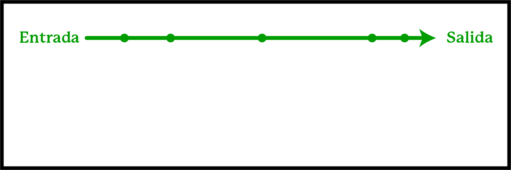
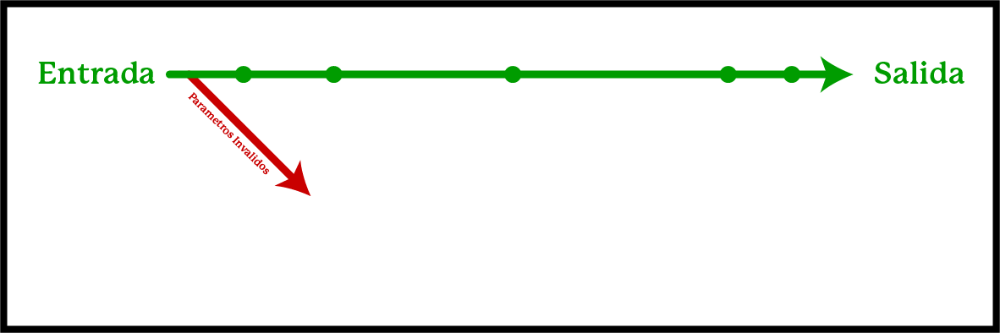
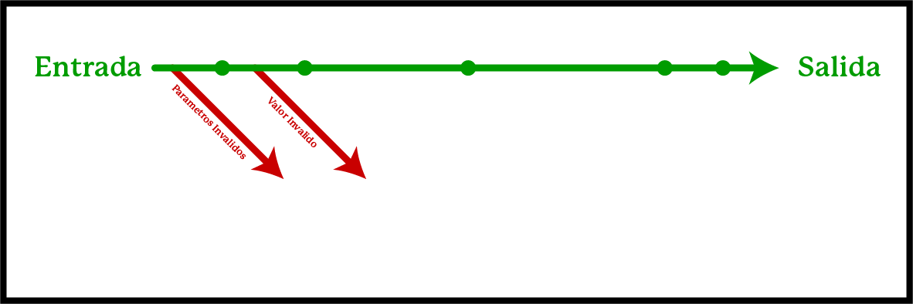
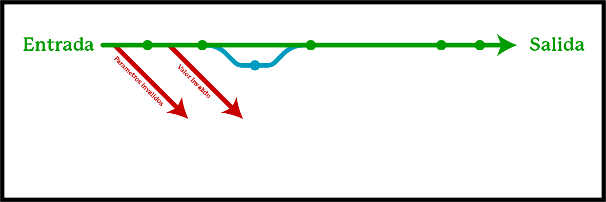
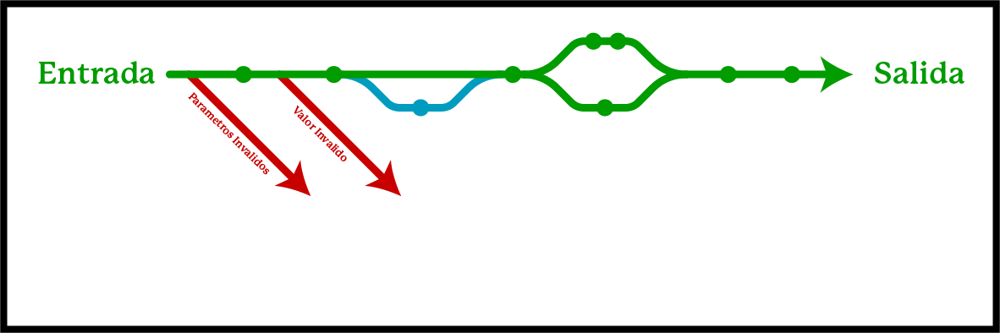
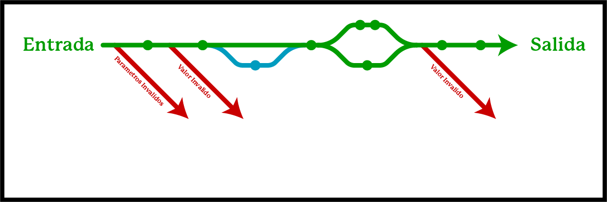
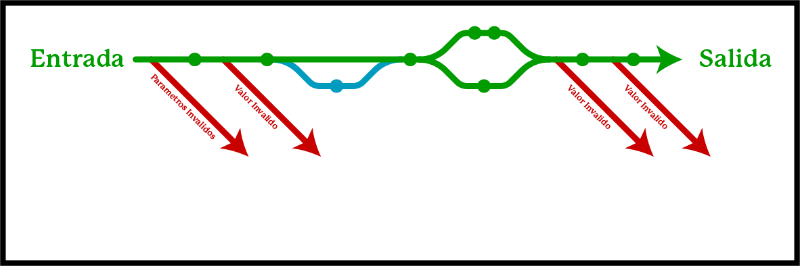

# Happy Path

:pencil: 2024-03 :heavy_minus_sign: :stopwatch: 7 min.

---

## Como visualizan un algoritmo?

---

## Como visualizan un algoritmo?

##

---

## Early Return

##

---

## "Guard Clause"

##

---

<!--
  _class: body-center align-center
-->

## Guard Clause

Un guard es como un early return, pero en la "mitad" de la función.

##

---

## Guard Clause

##

---

## "if" Branch

##

---

## "if-else" Branch

##

---

## Guard Clause 2

##

---

## Guard Clause 3

##

---

## Happy Path

Lo que llamamos el "happy path" es el camino verde.

Es cuando todo va bien, todos los datos son correctos y el algoritmo va de inicio a fin de la manera mas directa.

##

---

## Happy Path

##

---

## Happy Path & Fail-fast System

Un sistema "fail-fast" (falla rapido) es un sistema que detiene o cancela la operación en vez de intentar continuar con la operación de manera posiblemente incorrecta.

##

---

## Fail-fast System

"Si algo anda mal, cancela todo."

##

---

## Fail-fast System

Entonces, un sistema con **Early Returns** y **Guard Clauses** es un sistema "Fail-fast".

##

---

## Bouncer Pattern

Patrón de diseño donde se implementan **Early Returns** y **Guard Clauses** para evitar que se realice un proceso de manera incorrecta o datos incorrectos.

##

---

## Bouncer Pattern

Saca su nombre de los "bouncers", el guardia de seguridad presente en las entradas a discotecas o clubs VIP, que solo permite la entrada a cierta gente.

##

---

## Fail-fast System & Bouncer Pattern

Entonces un _fail-fast system_ está usando el _bouncer pattern_.

Comúnmente en backend se utiliza el _bouncer pattern_, se construye un _fail-fast system_.

##
