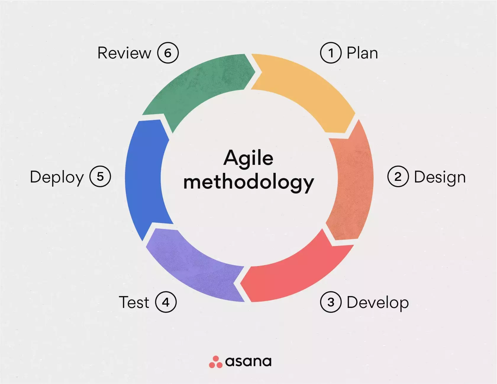

# Agile

---

## Agile Methodology / Metodología Agil

La metodología Agil es una guía de manejo de proyectos que divide un proyecto en fases dinamicas, llamadas **sprints**.

##

---

## Pasos de Metodología Agil

##

---

## Pasos de Metodología Agil

1. Planear
2. Diseñar
3. Desarrollar
4. Probar
5. Desplegar
6. Revisar

##

---

## Pasos de Metodología Agil

| Paso           | Responsable |
| -------------- | ----------- |
| 1. Planear     | PM + PO     |
| 2. Diseñar     | Team Lead   |
| 3. Desarrollar | Devs        |
| 4. Probar      | QA          |
| 5. Desplegar   | Team Lead   |
| 6. Revisar     | Team Lead   |

##

---

## Variaciones

- Kanban
- Scrum

##

---

## Kanban

Kanban es un tablerito con columnas y notitas.

Las columnas son etapas de desarrollo, las notitas son las tareas.

##

---

## Ejemplo de Kanban

| Pendientes       | En desarrollo         | En revision | Terminadas        |
| ---------------- | --------------------- | ----------- | ----------------- |
| 1. Comprar carne |                       |             |                   |
|                  | 2. Hacer diapositivas |             |                   |
|                  |                       |             | 3. Hacer almuerzo |
|                  | 4. Comer almuerzo     |             |                   |

##

---

## Kanban

En Kanban, todas las tareas del proyecto se ponen en el tablerito y se van asignando, y se avanza el proyecto.

##

---

## Scrum

La metodología Agil mas popular.

Tiene lo que se llaman "eventos".

##

---

## Scrum Events

1. Backlog Grooming
2. Sprint Planning
3. Daily Standup
4. Sprint Review
5. Sprint Retro

##

---

## Scrum Events - Backlog Grooming

Se revisa y actualiza el backlog. Se agregar nuevas tareas, clarificar existentes, etc.

##

---

## Scrum Events - Sprint Planning

Al comienzo de cada Sprint, se deciden que tareas del backlog serán las de este sprint.

##

---

## Scrum Events - Daily Standup

Una reunión diaria donde cada desarrollador dice que hizo ayer, que hará hoy, y que obstaculos hay.

##

---

## Scrum Events - Sprint Review

Al final de cada sprint, se muestra a accionistas y demás lo desarrollado y se recibe retroalimentación.

##

---

## Scrum Events - Sprint Retro

Al final de cada sprint, los desarrolladores se reunen y hablan de lo que salió bien, lo que salió mal, y lo que se puede cambiar para el proximo sprint.

##

---

## Scrum - Sprints

En Scrum los sprints duran entre 1 a 4 semanas.

Por lo general, los sprints son de 2 semanas.

##

---

## Scrum

En Scrum se suele utilizar tambien el tablerito Kanban, pero las tareas son unicamente las de el sprint actual.

##
