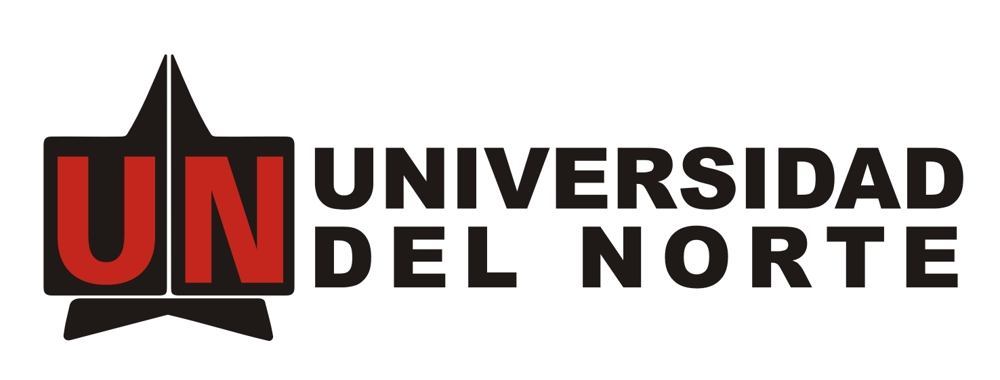

1. **IDENTIFICACIÓN**

|                                     |                                                                                                                                                                   |
| ----------------------------------- | ----------------------------------------------------------------------------------------------------------------------------------------------------------------- |
| División Académica                  | Ingenierías                                                                                                                                                       |
| Departamento                        | Ingeniería de Sistemas                                                                                                                                            |
| Nombre de la asignatura             | DLLO. APLICACIONES WEB BACKEND                                                                                                                                    |
| Código de la asignatura             | IST 4452                                                                                                                                                          |
| NRC                                 | 3515                                                                                                                                                              |
| Nivel de la asignatura              | Pregrado                                                                                                                                                          |
| Requisitos                          | - IST 2088 ALGORITMIA Y PROGRAMACIÓN I - IST 2089 ALGORITMIA Y PROGRAMACIÓN II - IST 2110 PROGRAMACIÓN ORIENTADA A OBJETOS  - IST 7111 BASES DE DATOS |
| Número de créditos de la asignatura | 3                                                                                                                                                                 |
| No. de horas teóricas del curso     | 1-2 horas                                                                                                                                                         |
| No. de horas prácticas por semana   | 1-2 horas                                                                                                                                                         |
| Número de semanas                   | 16                                                                                                                                                                |
| Idioma de la asignatura             | Español (con material en inglés)                                                                                                                                  |
| Modalidad de la asignatura          | Presencial                                                                                                                                                        |
| Nombre del Profesor                 | Andrés Movilla                                                                                                                                                    |
| Contacto del profesor               | movillaf@uninorte.edu.co                                                                                                                                          |
| Horario de atención                 | Cita previa solicitada mediante correo electrónico                                                                                                                |

2. **DESCRIPCIÓN DE LA ASIGNATURA**

En este curso se estudian conceptos y tecnologías web usadas en el desarrollo de aplicaciones del lado del servidor (backend). El lado no visible de las aplicaciones web se encarga de persistir la información a través de conexiones con bases de datos, realizar tareas asíncronas, enviar notificaciones, comunicarse con servicios externos, entre otros. El cliente que consume el backend espera el menor tiempo de respuesta posible, una tasa de error baja y que siempre esté disponible. Por esta razón, las soluciones desarrolladas en este entorno deben ser óptimas, escalables y confiables. Para lograr estos objetivos se cuentan con múltiples herramientas, metodologías de desarrollo y buenas prácticas. A diferencia de las aplicaciones de escritorio, los recursos físicos no se encuentran del lado del cliente, es por esto que el despliegue de aplicaciones web se realiza en la nube (en la mayoría de los casos).

3. **JUSTIFICACIÓN**

El desarrollo de aplicaciones web es un campo altamente demandado dentro de los profesionales TI, se registran déficits de casi 1 millón de vacantes disponibles alrededor del mundo $^{1}$. Las bases teóricas necesarias para comprender el desarrollo web son cubiertas dentro de los primeros semestres de carreras profesionales como Ingeniería de Sistemas.

---

4. **OBJETIVO GENERAL DEL CURSO**

Este curso tiene como objetivo brindarle al estudiante herramientas que le permitan tener la capacidad de diseñar e implementar soluciones para aplicaciones web backend.

5. **RESULTADO DE APRENDIZAJE**

Al finalizar la asignatura los estudiantes estarán en la capacidad de desarrollar una REST API
escrita en Javascript que:

- Persiste información usando una base de datos no relacional.
- Permite a los usuarios autenticarse.
- Puede ser desplegada utilizando Docker.
- Está escrita en TypeScript.
- Posee pruebas unitarias, y de integración.

6. **METODOLOGÍA**

La asignatura se desarrollará con la explicación teórica por parte del profesor, acompañada con ejemplos prácticos. El estudiante presentará de manera individual 4 evaluaciones durante el semestre y un proyecto final en grupo durante la última semana de clases. Todo el material utilizado en clase estará disponible en el Catálogo web.

7. **CONTENIDO**

| #   | Tópico                     | Número de horas | Semana |
| --- | -------------------------- | --------------- | ------ |
| 0   | Introducción               | 3               | 1      |
| 1   | Javascript                 | 12              | 2 - 5  |
| 2   | Git + NodeJS + NPM         | 6               | 6 - 7  |
| 3   | HTTP + REST + Arquitectura | 3               | 8      |
| 4   | MongoDB + Mongoose         | 3               | 9 - 10 |
| 5   | Pruebas                    | 3               | 11     |
| 6   | Encriptación               | 3               | 12     |
| 7   | Docker                     | 3               | 13     |
| 8   | Typescript                 | 3               | 14     |
| 9   | Lint + Pipelines           | 3               | 15-16  |

8. **EVALUACIÓN**

Las 3 primeras evaluaciones serán realizadas en el salón de clase de manera virtual a través de la plataforma, mientras que las ultimas 2 evaluaciones serán entregables con un mes de plazo para realizarse y entregarse.

| Evaluación       | %   | Fecha                           | Descripción                                 |
| ---------------- | --- | ------------------------------- | ------------------------------------------- |
| Evaluación 1     | 20  | 15 Agosto 2025                  | Evaluación de Javascript Basico             |
| Evaluación 2     | 20  | 12 Septiembre 2025               | Evaluación de Javascript Avanzado           |
| Evaluación 3     | 10  | 3 Octubre 2025                  | Evaluación Teórica Git, Node, NPM           |
| Evaluación 4     | 20  | 24 Octubre - 14 Noviembre 2025  | Construcción de REST API  |
| Evaluación final | 20  | 14 Noviembre - 5 Diciembre 2025 | Construcción de REST API con arquitectura de microservicios  |
| Talleres         | 10  | N/A                             | Talleres realizados a lo largo del semestre |

---

9. **REFERENCIAS**

   1. https://www.forbes.com/sites/forbestechcouncil/2021/04/13/analyzing-the-softwareengineer-shortage/

10. **BIBLIOGRAFÍA**

    1. Kyle Simpson. You Don't Know JS Yet (book series). 2015
    2. Mariot Tsitoara. Beginning Git and GitHub: A Comprehensive Guide to Version Control, Project Management, and Teamwork for the New Developer. 2019
    3. Mark Masse.REST API Design Rulebook. 2011
    4. Laura Bohill and Phil Sturgeon. Build APIs You Won't Hate: Everyone and their dog wants
       an API, so you should probably learn how to build them. 2015
