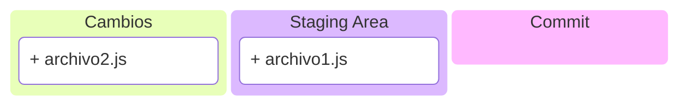
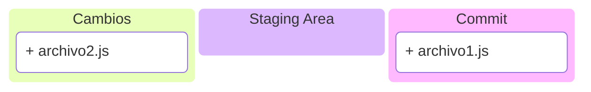
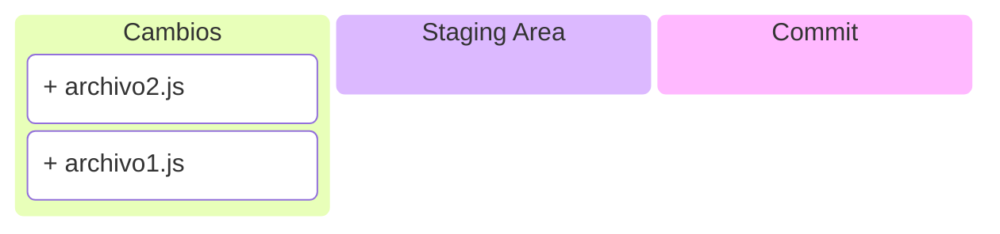

# Git Basico

✏️ 2025-01 ➖ ⏱️ 10 min.

---
layout: default-center
---

# Que es Git?

::contents::
Git es un sistema de control de versiones.

::header::
Semana 2: Git Basico

::footer::
{{ $page }} / {{ $nav.total }}

---
layout: default-center
---

# GitHub, GitLab, BitBucket

::contents::
Paginas web que proveen hosting de <span class="star">repositorios</span> de Git.

::header::
Semana 2: Git Basico

::footer::
{{ $page }} / {{ $nav.total }}

---
layout: default-y-center
---

# ⭐ Concepto 1: Repositorio

::contents::
Un repositorio (de software) o “repo”, es un almacenamiento para un software.

Usualmente, un repo equivale a un proyecto.

Un repo tiene un historial de cambios, donde cada entrada es un <span class="star">commit</span>.

::header::
Semana 2: Git Basico

::footer::
{{ $page }} / {{ $nav.total }}

---
layout: default-center
---

# ⭐ Concepto 2: Commit

::contents::
Un commit es una entrada en el historial de cambios de un repositorio.

"Un commit es un cambio."

::header::
Semana 2: Git Basico

::footer::
{{ $page }} / {{ $nav.total }}

---
layout: default-center
---

# ⭐ Concepto 3: .gitignore

::contents::
Archivo con reglas para excluir archivos o carpetas de git.

Si un archivo o carpeta ya tiene historial en git, el .gitignore es ignorado.

::header::
Semana 2: Git Basico

::footer::
{{ $page }} / {{ $nav.total }}

---
layout: default-y-center
---

<!--
_class: body-center
 -->

# ⭐ Concepto 3: .gitignore

::contents::
Ejemplo:

```
.env
.env.local
.env.development
```

::header::
Semana 2: Git Basico

::footer::
{{ $page }} / {{ $nav.total }}

---
layout: default-center
---

# ⭐ Concepto 4: Stage y Unstage

::contents::
Los cambios realizados en un software o proyecto deben ser agregados a lo que se llama “staging área”.

::header::
Semana 2: Git Basico

::footer::
{{ $page }} / {{ $nav.total }}

---
layout: default-center
---

# ⭐ Concepto 4: Stage y Unstage

::contents::
Creé dos archivos: archivo1.js y archivo2.js


::header::
Semana 2: Git Basico

::footer::
{{ $page }} / {{ $nav.total }}

---
layout: default-center
---

# ⭐ Concepto 4: Stage y Unstage

::contents::
Hice **stage** de la creacion de archivo1.js



::header::
Semana 2: Git Basico

::footer::
{{ $page }} / {{ $nav.total }}

---
layout: default-center
---

# ⭐ Concepto 4: Stage y Unstage

::contents::
Hago commit de los cambios en la staging area.



::header::
Semana 2: Git Basico

::footer::
{{ $page }} / {{ $nav.total }}

---
layout: default-center
---

# ⭐ Concepto 4: Stage y Unstage

::contents::
Que pasa si hago un commit ahora mismo?


::header::
Semana 2: Git Basico

::footer::
{{ $page }} / {{ $nav.total }}

---
layout: default-center
---

# ⭐ Concepto 4: Stage y Unstage

::contents::
Nada, porque el staging area está vacio.


::header::
Semana 2: Git Basico

::footer::
{{ $page }} / {{ $nav.total }}

---
layout: default-y-center
---

# ⭐ Concepto 4: Stage y Unstage

::contents::
Los cambios realizados en un software o proyecto deben ser agregados a lo que se llama "staging area".

Al hacer un commit, **solo lo que esté en el staging area** será parte del commit.

::header::
Semana 2: Git Basico

::footer::
{{ $page }} / {{ $nav.total }}

---
layout: default-center
---

# ⭐ Concepto 4: Stage y Unstage

::contents::
Unstage es cuando un cambio en el staging area es removido del staging area.


::header::
Semana 2: Git Basico

::footer::
{{ $page }} / {{ $nav.total }}

---
layout: default-center
---

# ⭐ Concepto 4: Stage y Unstage

::contents::
Unstage es cuando un cambio en el staging area es removido del staging area.



::header::
Semana 2: Git Basico

::footer::
{{ $page }} / {{ $nav.total }}

---
layout: default-y-center
---

# ⭐ Concepto 5: Remote

::contents::
Remote es el repositorio (y branches) que están en la nube.

**Como pueden estar las branches en la nube?**

::header::
Semana 2: Git Basico

::footer::
{{ $page }} / {{ $nav.total }}

---
layout: default-y-center
---

# ⭐ Concepto 6: Push + Pull

::contents::
**Push**: Enviar cambios de una branch local a la versión remota de la branch.
_Si la branch remota no existe, **push** la crearía en el repo remote._

**Pull**: Bajar los cambios de una branch remota a la versión local de la branch.

::header::
Semana 2: Git Basico

::footer::
{{ $page }} / {{ $nav.total }}

---
layout: default-y-center
---

# Ahora mismo

::contents::
1. Creen una cuenta de Github (si no la tienen).
2. Creen un repositorio de Github nuevo, con un nombre similar a "talleres-dllo-backend".

- Hay un botón verde en la pagina principal de Github que dice **New**, o **Nuevo**.
- Lo unico requerido es que le pongan nombre.

::header::
Semana 2: Git Basico

::footer::
{{ $page }} / {{ $nav.total }}

---
layout: default-y-center
---

# Suban un archivo

::contents::
1. Creen un archivo en su computador llamado "taller1.js".
2. Suban el archivo al repositorio.

- En la pagina del repositorio debe haber un archivo que diga **Add file**, o **Agregar archivo**
- Alternativamente, pueden arrastar el archivo sobre el repositorio.
- Finalmente, usen el botón verde de **Commit**.

::header::
Semana 2: Git Basico

::footer::
{{ $page }} / {{ $nav.total }}

---
layout: cover
---

# 🎉

# Felicidades!
