# Git Avanzado

✏️ 2025-01 ➖ ⏱️ 25 min.

::header::
Semana 7: Git II

::footer::
{{ $page }} / {{ $nav.total }}

---
layout: default-center
---

# Comandos

::contents::
https://github.com/joshnh/Git-Commands/blob/master/READMEes.md

::header::
Semana 7: Git II

::footer::
{{ $page }} / {{ $nav.total }}

---
layout: default-y-center
---

# ⭐ Concepto 7: Clonar

::contents::
Acto de hacer una copia local de un repositorio remoto.

**Actividad:** Clonen su repositorio de talleres.

```bash
$ git clone [url]
```

::header::
Semana 7: Git II

::footer::
{{ $page }} / {{ $nav.total }}

---
layout: default-y-center
---

# ⭐ Concepto 7+1: Branches

::contents::
Una "branch", o rama, es una línea de desarrollo independiente al desarrollo
principal.

Las ramas permiten el desarrollo simultaneo de varias tareas sin
dañar el producto presentado al cliente, ni el trabajo de los compañeros.

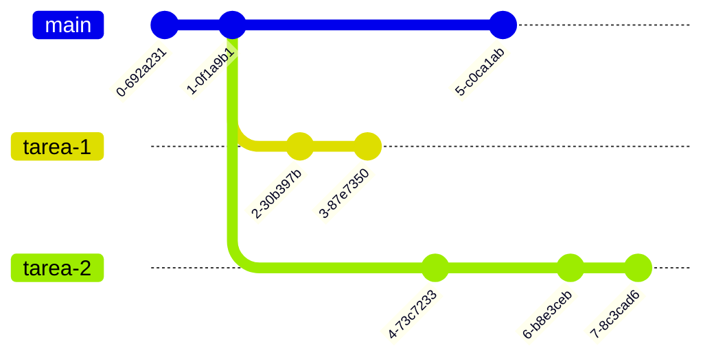

::header::
Semana 7: Git II

::footer::
{{ $page }} / {{ $nav.total }}

---
layout: default-y-center
---

# ⭐ Concepto 7+1: Branches

::contents::
Las ramas parten de un commit "origen", y luego suelen juntarse a otra rama.

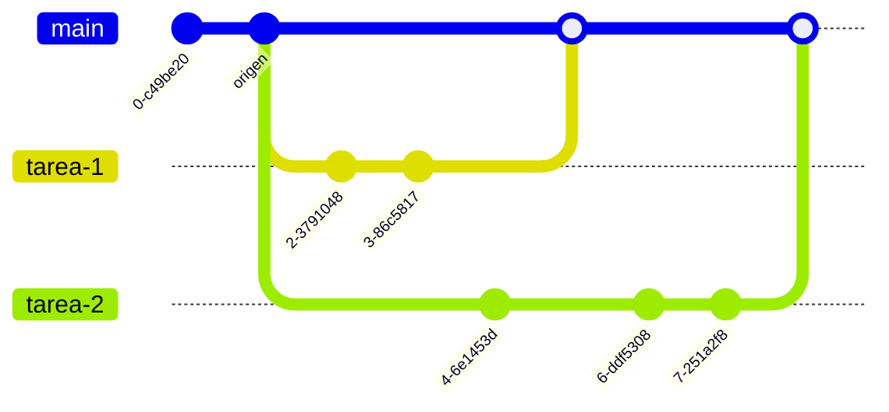

::header::
Semana 7: Git II

::footer::
{{ $page }} / {{ $nav.total }}


---
layout: default-y-center
---

# ⭐ Concepto 7+1: Branches

::contents::
**Actividad:** Creen una branch en el local de su repositorio.

```bash
$ git branch [nombre]
```

::header::
Semana 7: Git II

::footer::
{{ $page }} / {{ $nav.total }}

---
layout: two-cols-header
---

## Setup normal en produccion y flujo de trabajo

::left::
Por lo general, se manejan las siguientes ramas:

1. main / production / prod
2. staging / testing / qa
3. development / develop / dev
4. features / fixes / refactors / chores / etc

::right::


::header::
Semana 7: Git II

::footer::
{{ $page }} / {{ $nav.total }}

---
layout: two-cols-header
---

# 1. main / production / prod

::left::
Esta rama es la que usa el cliente final.

Es la versión actual desplegada, funcional y estable.

A esta rama no se permiten commits directos\*.

::bottom::
###### \* A menos que sea 200% necesario, lo hace un Senior developer, y es lo que se le llama un **hotfix**.

::right::


::header::
Semana 7: Git II

::footer::
{{ $page }} / {{ $nav.total }}

---
layout: two-cols-header
---


 <style scoped>
  p:nth-child(8) {
    font-size: 0.75rem;
    color: rgba(var(--text-color), 0.7);
  }
 </style>

# 2. staging / testing / qa

::left::
Esta rama se usa internamente para probar o demostrar la aplicación afuera del equipo de desarrollo.

Está desplegada en un link interno.

Es funcional y estable.

Al ser aprobada, todos los cambios de staging se mandan a main.

A esta rama no se permiten commits directos\*.

::bottom::
###### \* En casos muy extraños.

::right::


::header::
Semana 7: Git II

::footer::
{{ $page }} / {{ $nav.total }}

---
layout: two-cols-header
---

# 3. development / develop / dev

::left::
Esta rama se usa internamente para verificar que “hasta ahora todo está bien”, usualmente adentro del equipo de desarrollo.

Está desplegada en un link interno.

A veces funciona. Estabilidad es pedir mucho.

Al ser aprobada, todos los cambios de dev se mandan a staging.

A esta rama no se permiten commits directos\*.

::right::


::bottom::
###### \* Porque para que?

::header::
Semana 7: Git II

::footer::
{{ $page }} / {{ $nav.total }}

---
layout: two-cols-header
---

# 4. features / fixes / refactors / chores / etc

::left::
No es una sola rama, son varias.

Cada una de estas ramas representa una tarea en proceso de un desarrollador.

Al ser aprobada, la rama se junta con dev.

::right::
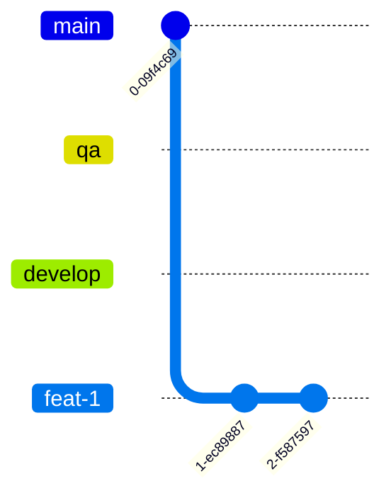

::header::
Semana 7: Git II

::footer::
{{ $page }} / {{ $nav.total }}

---
layout: two-cols-header
---

# ⭐ Concepto 9: Check Out

::left::
Accion de moverse entre 2 ramas. <br/>
Al crear una branch, no nos movemos a la branch creada automaticamente.

_Estoy en rama 1, hago check out a rama 2._

```bash
$ git checkout [nombre de rama]
```

::right::

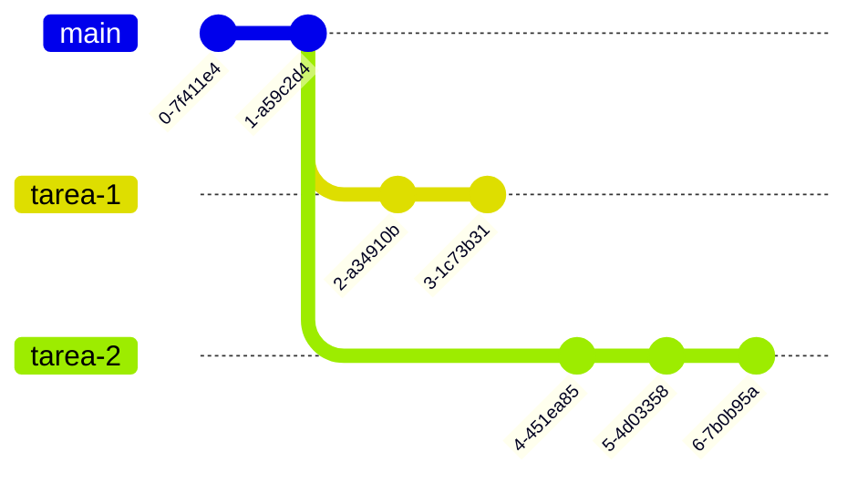

::header::
Semana 7: Git II

::footer::
{{ $page }} / {{ $nav.total }}

---
layout: default-y-center
---

# Flujo de trabajo normal de un dev

::contents::

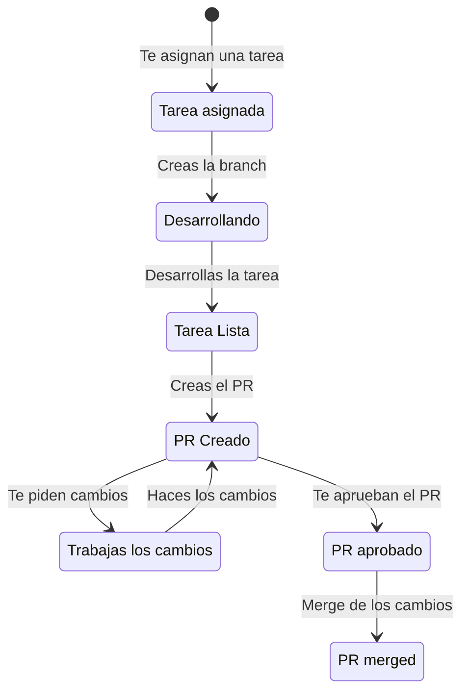

::header::
Semana 7: Git II

::footer::
{{ $page }} / {{ $nav.total }}

---
layout: default-y-center
---

# Flujo de trabajo normal de un dev

::contents::
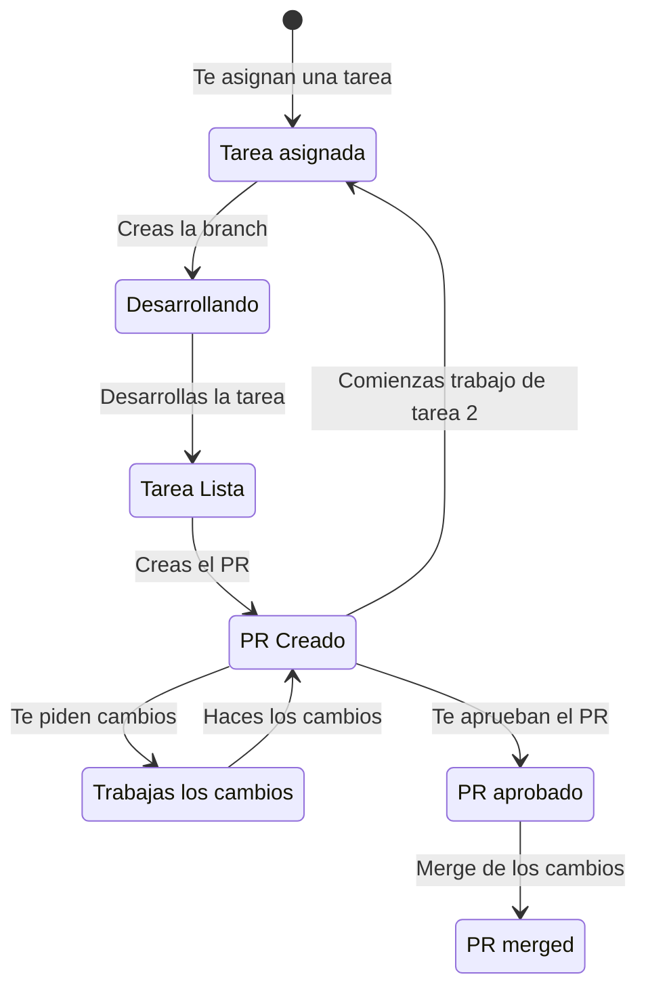

::header::
Semana 7: Git II

::footer::
{{ $page }} / {{ $nav.total }}

---
layout: default-center
---

# ⭐ Concepto 10: Stash

::contents::
Guardar unos cambios en proceso para mas tarde.

::header::
Semana 7: Git II

::footer::
{{ $page }} / {{ $nav.total }}

---
layout: default-y-center
---

# Stash vs commit?

::contents::
1. No se puede hacer checkout con cambios pendientes.
2. A veces un repositorio no permite commits con errores.
3. Quizá hiciste los cambios en la branch que no es.

::header::
Semana 7: Git II

::footer::
{{ $page }} / {{ $nav.total }}

---
layout: default-y-center
---

# ⭐ Concepto 11: Merge

::contents::
Merge es la acción de juntar una rama con otra, y con ella, sus cambios.

**Actividad:** Realicen cambios en la rama actual, hagan checkout a main, y hagan merge de los cambios.

```bash
- Agrega cambios a staging area
$ git add .
```

```bash
- Realiza commit de los cambios
$ git commit -m "mensaje de commit"
```

```bash
- Realiza un merge de una rama a la rama actual
$ git merge [nombre de la rama]
```


::header::
Semana 7: Git II

::footer::
{{ $page }} / {{ $nav.total }}

---
layout: default-y-center
---

# Quien decide los merges?

::contents::
1. De feature -> dev, el líder del equipo de desarrollo, o cualquier persona que sepa lo que hace.

2. De dev -> staging, el líder del equipo de desarrollo, o el product owner/project manager

3. De staging -> production, el product owner/project manager

::header::
Semana 7: Git II

::footer::
{{ $page }} / {{ $nav.total }}


---
layout: default-y-center
---

# ⭐ Concepto 12: Stash

::contents::
Puedes crear un stash con los cambios que tengas, y hacer **pop**, es decir tomar los cambios y destruir la stash, o **apply**, es decir tomar los cambios y dejar la stash ahi.

**Apply** permite aplicar unos mismos cambios de una stash a varias branches, por ejemplo.

::header::
Semana 7: Git II

::footer::
{{ $page }} / {{ $nav.total }}

---
layout: default-center
---

# ⭐ Concepto 12+1: Blame

::contents::
Accion que muestra el autor de un cambio.

::header::
Semana 7: Git II

::footer::
{{ $page }} / {{ $nav.total }}

---
layout: default-center
---

# ⭐ Concepto 14: Cherry Pick

::contents::
Accion de copiar un commit de un branch, o sus cambios, (con el proposito de aplicarlo de nuevo).

::header::
Semana 7: Git II

::footer::
{{ $page }} / {{ $nav.total }}

---
layout: two-cols-header
---

# ⭐ Concepto 15: Rebase

Accion de cambiar el commit origen de una branch/rama.

::left::
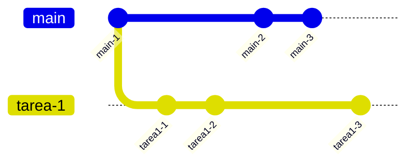
::right::
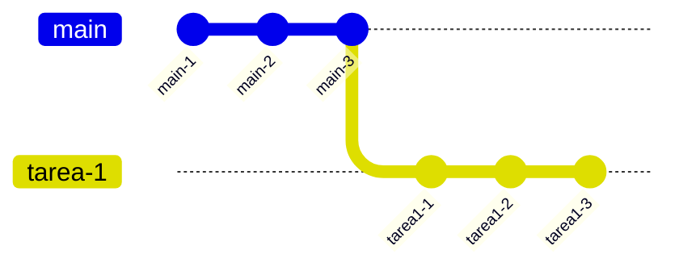

::header::
Semana 7: Git II

::footer::
{{ $page }} / {{ $nav.total }}

---
layout: default-center
---

# ⭐ Concepto 16: Reset

::contents::
Un reset borra los commits de una branch desde el ultimo commit, hasta el commit seleccionado.

Los stashes no se ven afectados.

::header::
Semana 7: Git II

::footer::
{{ $page }} / {{ $nav.total }}

---
layout: two-cols-header
---

# ⭐ Concepto 16: Reset: Hard Reset

::left::
En un hard reset, toda la informacion de los commits a borrar se pierde.

Cualquier cambio que se tenía en local, o en staging, se pierde.

::right::
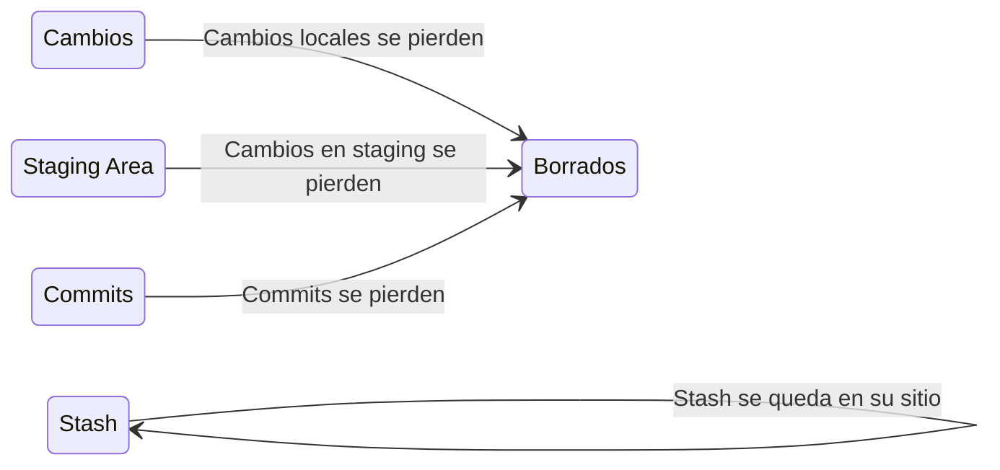

::header::
Semana 7: Git II

::footer::
{{ $page }} / {{ $nav.total }}

---
layout: two-cols-header
---

# ⭐ Concepto 16: Reset: Soft Reset

::left::
En un soft reset, toda la informacion de los commits a borrar se vuelven cambios actuales.

Cualquier cambio que se tiene en local, o en staging, se queda donde estaba.

::right::
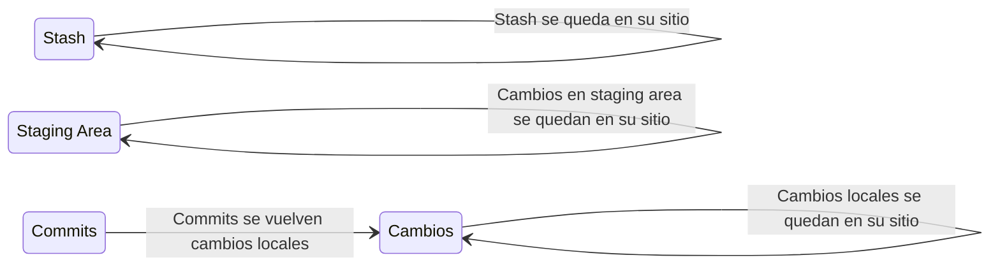

::header::
Semana 7: Git II

::footer::
{{ $page }} / {{ $nav.total }}

---
layout: two-cols-header
---

# ⭐ Concepto 16: Resets

::left::
### Soft
En un soft reset, toda la informacion de los commits a borrar se vuelven cambios actuales.

Cualquier cambio que se tiene en local, o en staging, se queda donde estaba.


::right::
### Hard
En un hard reset, toda la informacion de los commits a borrar se pierde.

Cualquier cambio que se tenía en local, o en staging, se pierde.
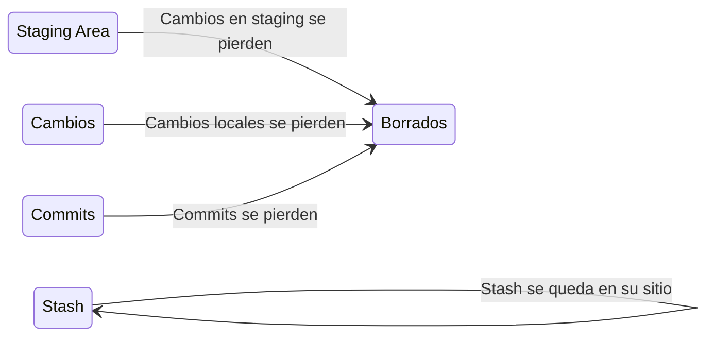

::header::
Semana 7: Git II

::footer::
{{ $page }} / {{ $nav.total }}


---
layout: default-center
---

# ⭐ Concepto 17: Conflictos

::contents::
Sucede cuando dos branches que se intentan merge tienen cambios en la misma ubicacion (aproximadamente).

Para terminar el merge, esos conflictos deben resolverse.

En el codigo, los conflictos se ven asi

```js
// <<<<<< HEAD
// codigo1
// =======
// codigo2
// >>>>>> new_branch_to_merge_later
```

::header::
Semana 7: Git II

::footer::
{{ $page }} / {{ $nav.total }}

---
layout: default-y-center
---

# ⭐ Concepto 17+1: Revisiones y Aprobaciones

::contents::
En un ambiente profesional, las ramas no se les hacen *merge* asi como si nada.

Otro desarrollador lo debe revisar y lo aprobar.

Tras ser aprobado, se hace *merge*.

Usualmente no se rechazan, solo se siguen trabajando.

::header::
Semana 7: Git II

::footer::
{{ $page }} / {{ $nav.total }}

---
layout: cover
---

# 🎉

# Saben Git!
