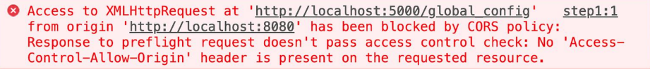

```mermaid {scale: 0.8}
sequenceDiagram
    participant DominioA
    participant PaginaA
    participant DominioB

    PaginaA->>DominioA: GET image1.png
    DominioA->>PaginaA: ✅ GET image1.png

    PaginaA->>DominioB: GET image2.png
    DominioB->>PaginaA: ❎ GET image2.png
```

# Node & NPM

✏️ 2025-01 ➖ ⏱️ 30 min.

::header::
Semana 7: Node

::footer::
{{ $page }} / {{ $nav.total }}

---
layout: default-center
---

# Que es NodeJS?

::contents::
Un _runtime environment_ para JS.

::header::
Semana 7: Node

::footer::
{{ $page }} / {{ $nav.total }}

---
layout: default-center
---

# Que es un _Runtime Environment_ ?

::contents::
Coloquialmente, es donde corre un programa.

::header::
Semana 7: Node

::footer::
{{ $page }} / {{ $nav.total }}

---
layout: default-center
---

# Que es NPM?

::contents::
**N**ode **P**ackage **M**anager

::header::
Semana 7: Node

::footer::
{{ $page }} / {{ $nav.total }}

---
layout: default-center
---

# Que es un package?

::contents::
Un “pequeño” software instalable/agregable a una aplicación de Node que agrega/modifica funcionalidad.

Todos los packages están listados en https://www.npmjs.com/

::header::
Semana 7: Node

::footer::
{{ $page }} / {{ $nav.total }}

---
layout: two-cols-header
---

# Creando un proyecto de Node

::left::
## Normal
```bash
$ npm init
```

::right::
## Rapido
```bash
$ npm init --y
```

::header::
Semana 7: Node

::footer::
{{ $page }} / {{ $nav.total }}

---
layout: default-center
---

# Creando un proyecto de Node

::contents::
```json {*}{lines:true}
{
  "name": "test",
  "version": "1.0.0",
  "description": "",
  "main": "index.js",
  "scripts": {
    "test": "node index"
  },
  "author": "",
  "license": "ISC",
}
```

::header::
Semana 7: Node

::footer::
{{ $page }} / {{ $nav.total }}

---
layout: cover
---

# Express

---
layout: default-y-center
---

# Un server sencillo

::contents::
```js {*}{lines:true}
const http = require("http");

function requestListener(req, res) {
  res.writeHead(200);
  res.end("Hello, World!");
}

const server = http.createServer(requestListener);
server.listen(8080);
```

::header::
Semana 7: Node

::footer::
{{ $page }} / {{ $nav.total }}

---
layout: default-center
---

# Nodemon

::contents::
Un package que nos permite hacer "hot reloading", es decir, que al realizar cambios el servidor automaticamente se reinicie.

::header::
Semana 7: Node

::footer::
{{ $page }} / {{ $nav.total }}

---
layout: default-center
---

# Nodemon?

::contents::
Node ya implementó una manera de hacer esto sin instalar packages externos:

```bash
$ node --watch index.js
```

Sin embargo, Nodemon tiene otras funcionalidades.

::header::
Semana 7: Node

::footer::
{{ $page }} / {{ $nav.total }}

---
layout: default-center
---

# Instalar un package

::contents::
```bash
$ npm i {nombre}
```

::header::
Semana 7: Node

::footer::
{{ $page }} / {{ $nav.total }}

---
layout: default-center
---
# Instalar nodemon

::contents::
```bash
npm i nodemon
```

```bash
npm install nodemon
```

::header::
Semana 7: Node

::footer::
{{ $page }} / {{ $nav.total }}

---
layout: default-y-center
---

# Responder con JSON

::contents::
```js {*}{lines:true}
const requestListener = function (req, res) {
  res.setHeader("Content-Type", "application/json");
  res.writeHead(200);
  res.end(`{"message": "This is a JSON response"}`);
};
```

::header::
Semana 7: Node

::footer::
{{ $page }} / {{ $nav.total }}

---
layout: default-y-center
---

# JSON

::contents::
**J**ava **S**cript **O**bject **N**otation

O, Notación de Objeto de JavaScript.

Es una manera de representar (en una string) un objeto de JavaScript.
Tipicamente se espera enviar y recibir datos usando JSON.

::header::
Semana 7: Node

::footer::
{{ $page }} / {{ $nav.total }}

---
layout: default-center
---

# Express

::contents::
```bash
$ npm i express
```

::header::
Semana 7: Node

::footer::
{{ $page }} / {{ $nav.total }}

---
layout: default-center
---

# Inicialización de un servidor de Express

::contents::
```js {*}{lines:true}
const express = require("express");
const app = express();
```

::header::
Semana 7: Node

::footer::
{{ $page }} / {{ $nav.total }}

---
layout: default-y-center
---

# Un Endpoint en Express

::contents::
```js {*}{lines:true}
app.get("/", async function (req, res) {
  res.status(200).json({ message: "Success" });
});
```

::header::
Semana 7: Node

::footer::
{{ $page }} / {{ $nav.total }}

---
layout: default-y-center
---

# Escuchar por peticiones en Express

::contents::
```js {*}{lines:true}
const port = 3000;

app.listen(port, () => {
  console.log(`Example app listening on port ${port}`);
});
```

::header::
Semana 7: Node

::footer::
{{ $page }} / {{ $nav.total }}

---
layout: default-center
---

# Operaciones basicas de almacenamiento

::contents::
## CRUD

::header::
Semana 7: Node

::footer::
{{ $page }} / {{ $nav.total }}

---
layout: default-y-center
---

# Operaciones basicas de almacenamiento

::contents::
1. # C

2. # R

3. # U

4. # D


::header::
Semana 7: Node

::footer::
{{ $page }} / {{ $nav.total }}

---
layout: default-y-center
---

# Operaciones basicas de almacenamiento

::contents::
1. # C

2. # R

3. # U

4. # creaDo


::header::
Semana 7: Node

::footer::
{{ $page }} / {{ $nav.total }}

---
layout: default-y-center
---

# Operaciones basicas de almacenamiento

::contents::
1. # C

2. # R

3. # hUsmear

4. # creaDo


::header::
Semana 7: Node

::footer::
{{ $page }} / {{ $nav.total }}

---
layout: default-y-center
---

# Operaciones basicas de almacenamiento

::contents::
1. # aCtualizar

2. # R

3. # hUsmear

4. # creaDo


::header::
Semana 7: Node

::footer::
{{ $page }} / {{ $nav.total }}

---
layout: default-y-center
---

# Operaciones basicas de almacenamiento

::contents::
1. # aCtualizar

2. # borRar

3. # hUsmear

4. # creaDo


::header::
Semana 7: Node

::footer::
{{ $page }} / {{ $nav.total }}

---
layout: default-y-center
---

# Operaciones basicas de almacenamiento

::contents::
1. # **C**reate
2. # **R**ead
3. # **U**pdate
4. # **D**elete

::header::
Semana 7: Node

::footer::
{{ $page }} / {{ $nav.total }}

---
layout: default-y-center
---


# Metodos HTTP

::contents::
|         |        |         |
| ------- | ------ | ------- |
| GET     | HEAD   | POST    |
| PUT     | DELETE | CONNECT |
| OPTIONS | TRACE  | PATCH   |

::header::
Semana 7: Node

::footer::
{{ $page }} / {{ $nav.total }}

---
layout: default-y-center
---

# Metodos HTTP

::contents::
Tipicamente usados en REST:
| GET | PUT | POST | PATCH | DELETE |
| --- | --- | ---- | ----- | ------ |

No tan tipicos:
| OPTIONS | TRACE | HEAD | CONNECT |
| ------- | ----- | ---- | ------- |

::header::
Semana 7: Node

::footer::
{{ $page }} / {{ $nav.total }}

---
layout: default-y-center
---

# Metodos HTTP => CRUD

::contents::
| GET  | PUT           | POST   | PATCH  | DELETE |
| ---- | ------------- | ------ | ------ | ------ |
| READ | UPDATE/CREATE | CREATE | UPDATE | DELETE |

::header::
Semana 7: Node

::footer::
{{ $page }} / {{ $nav.total }}

---
layout: default-center
---

# Put vs Patch

::contents::
Put sobre-escribe (o crea) un recurso.

Patch modifica un recurso ya existente.

::header::
Semana 7: Node

::footer::
{{ $page }} / {{ $nav.total }}

---
layout: default-y-center
---

# Metodos HTTP => CRUD

::contents::
| GET  | PUT           | POST   | PATCH  | DELETE |
| ---- | ------------- | ------ | ------ | ------ |
| READ | UPDATE/CREATE | CREATE | UPDATE | DELETE |

::header::
Semana 7: Node

::footer::
{{ $page }} / {{ $nav.total }}

---
layout: default-y-center
---

# CORS

::contents::
**Cross-Origin Resource Sharing**

1. Medida de seguridad para prevenir abuso.
2. Previene utilizar recursos de otro origen a menos que este lo permita.

::header::
Semana 7: Node

::footer::
{{ $page }} / {{ $nav.total }}

---
layout: default-center
---

# CORS

::contents::


::header::
Semana 7: Node

::footer::
{{ $page }} / {{ $nav.total }}

---
layout: default-center
---

# CORS

::contents::


::header::
Semana 7: Node

::footer::
{{ $page }} / {{ $nav.total }}

---
layout: default-center
---

# Metodo `OPTIONS` + CORS

::contents::
El metodo `OPTIONS` tiene como proposito preguntar los permisos de CORS al origen del recurso previo a solicitar el recurso.

Un problema de CORS 99% de las veces es un problema de backend.

::header::
Semana 7: Node

::footer::
{{ $page }} / {{ $nav.total }}

---
layout: default-center
---

# CORS

::contents::
Un navegador hace un metodo `OPTIONS` para saber los permisos.

Un cliente REST NO.

Clientes REST como Postman, ThunderClient, Insomnia, etc.

::header::
Semana 7: Node

::footer::
{{ $page }} / {{ $nav.total }}

---
layout: default-y-center
---

# CORS

::contents::
> Front end dev: "Este endpoint me tira error."

<br />

> Back end dev: "Pero lo pruebo en Postman y me funciona sin problema."

Conclusión: Revisa CORS.

::header::
Semana 7: Node

::footer::
{{ $page }} / {{ $nav.total }}

---
layout: default-y-center
---

# CORS - Solución

::contents::
```js {*}{lines:true}
app.use(function (req, res, next) {
  res.header("Access-Control-Allow-Origin", "*");
  res.header("Access-Control-Allow-Headers", "*");

  if (req.method === "OPTIONS") {
    res.header("Access-Control-Allow-Methods", "PUT, POST, PATCH, DELETE, GET");
    return res.status(200).json({});
  }

  next();
});
```

Agregar este endpoint al inicio del server responde toda petición de `OPTIONS` con accesso permitido para todo.

::header::
Semana 7: Node

::footer::
{{ $page }} / {{ $nav.total }}

---
layout: default-center
---

# CORS - Solución

::contents::
```bash
$ npm i cors
```

Este package hace todo lo que hace el endpoint anterior.

::header::
Semana 7: Node

::footer::
{{ $page }} / {{ $nav.total }}

---
layout: default-y-center
---

# CORS - Solución 2

::contents::
```js {*}{lines:true}
let express = require("express");
let cors = require("cors");
let app = express();

app.use(cors());

app.get("/products/:id", function (req, res, next) {
  res.json({ msg: "CORS resuelto!" });
});
```

::header::
Semana 7: Node

::footer::
{{ $page }} / {{ $nav.total }}

---
layout: default-y-center
---

# "Fallbacks"

::contents::
```js {*}{lines:true}
app.use(async function (req, res) {
  res.status(404).json({ message: "Not found." });
});
```

Este endpoint va al final, para recibir toda petición que no fue servida por otros endpoints.

::header::
Semana 7: Node

::footer::
{{ $page }} / {{ $nav.total }}


---
layout: default-y-center
---

::contents::
```js {*}{lines:true}
// imports
const express = require("express");
const cors = require("cors");
const app = express();
const port = 3000;

// resuelve CORS
app.use(cors());

// un endpoint GET
app.get("/products/:id", function (req, res, next) {
  res.json({ msg: "CORS resuelto!" });
});

// endpoint de 404
app.use(async function (req, res) {
  res.status(404).json({ message: "Not found." });
});

// 'iniciar' servidor
app.listen(port, () => {
  console.log(`Example app listening on port ${port}`);
});
```

::header::
Semana 7: Node

::footer::
{{ $page }} / {{ $nav.total }}

---
layout: cover
---

# 🎉

# Saben Node y Express!
