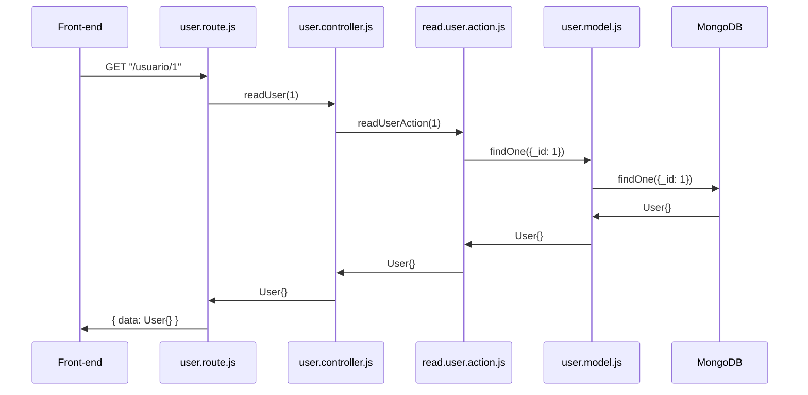

# Arquitectura

✏️ 2025-01 ➖ ⏱️ 20 min.

::header::
Semana 8: Arquitectura

::footer::
{{ $page }} / {{ $nav.total }}

---
layout: default-y-center
---


# Arquitectura del Backend

::contents::
1. Monolito
2. Microservicios
3. Serverless

::header::
Semana 8: Arquitectura

::footer::
{{ $page }} / {{ $nav.total }}

---
layout: default-y-center
---

# Monolito

::contents::
Todo el codigo de la aplicación está en un solo proyecto, una sola app, un solo repo.

La app se despliega completa, y si se necesita mayor capacidad, se despliega una mayor cantidad.

::header::
Semana 8: Arquitectura

::footer::
{{ $page }} / {{ $nav.total }}

---
layout: default-y-center
---

# Microservicios

::contents::
Lo que sería una aplicación "monolito" está separada en secciones, en servicios pequeños e independientes que se comunican entre si con una API interna.

Esta arquitectura permite desplegar los servicios independientes de cada uno, por lo que podrías, por ejemplo, desplegar 3 veces el servicio de usuario, pero 1 sola vez el servicio de autenticación.

::header::
Semana 8: Arquitectura

::footer::
{{ $page }} / {{ $nav.total }}

---
layout: default-y-center
---

# Serverless

::contents::
Similar a microservicios, con la diferencia que le dejas el control de la infraestructura y despliegue al proveedor del cloud hosting.

::header::
Semana 8: Arquitectura

::footer::
{{ $page }} / {{ $nav.total }}

---
layout: default-y-center
---

# Arquitectura de la aplicación Backend

::contents::
1. Clean Architecture
2. Hexagonal Architecture
3. Onion Architectura
4. Screaming Architecture
5. DCI
6. BCE

::header::
Semana 8: Arquitectura

::footer::
{{ $page }} / {{ $nav.total }}

---
layout: default-y-center
---

# Arquitectura de la aplicación Backend

::contents::
1. **Clean Architecture**
2. Hexagonal Architecture
3. Onion Architectura
4. Screaming Architecture
5. DCI
6. BCE

::header::
Semana 8: Arquitectura

::footer::
{{ $page }} / {{ $nav.total }}

---
layout: default-center
---

<style>
img {
  width: 60%;
  margin: 0 auto;
}
</style>

# Clean Architecture

::contents::


::header::
Semana 8: Arquitectura

::footer::
{{ $page }} / {{ $nav.total }}

---
layout: default-y-center
---

# Capas Clean Architecture

::contents::
##

1. Capa 1 > Frontend
2. Capa 2 > Rutas
3. Capa 3 > Controladores
4. Capa 4 > Casos de Uso / Acciones
5. Capa 5 > Base de Datos

Esto es un poco distinto al diagrama porque el diagrama ubica la DB en las afueras.

::header::
Semana 8: Arquitectura

::footer::
{{ $page }} / {{ $nav.total }}

---
layout: default-y-center
---

# Capa 1 - Frontend

::contents::
Esta capa es literalmente el frontend.

El frontend realiza requests al backend. La **capa 2** recibe esos requests.

::header::
Semana 8: Arquitectura

::footer::
{{ $page }} / {{ $nav.total }}

---
layout: default-y-center
---

# Capa 2 - Rutas

::contents::
Esta capa recibe los requests por parte del frontend.

Es donde se define la ruta del endpoint y que función de la **capa 3** se ejecuta.

Adicionalmente, podría ser responsable de extraer los datos del request (body, query, params).

**Existe un archivo para cada modelo.**

::header::
Semana 8: Arquitectura

::footer::
{{ $page }} / {{ $nav.total }}

---
layout: default-y-center
---

# Capa 3 - Controladores

::contents::
Esta capa es ejecutada por la **capa 2** con todos los datos necesarios para su ejecución pasado por parametros.

Esta capa ejecuta todas las funciones de la **capa 4** que considere necesario para realizar su labor.

**Existe un archivo para cada modelo.**

::header::
Semana 8: Arquitectura

::footer::
{{ $page }} / {{ $nav.total }}

---
layout: default-y-center
---

# Capa 4 - Casos de Uso / Acciones

::contents::
Esta capa es ejecutada por la **capa 3** con todos los datos necesarios para su ejecución pasado por parametros.

Esta capa realiza llamados a la **capa 5** y retorna el resultado.

**Existe un archivo para cada accion de cada modelo.**

::header::
Semana 8: Arquitectura

::footer::
{{ $page }} / {{ $nav.total }}

---
layout: default-y-center
---

# Capa 5 - Base de Datos

::contents::
Esta capa es literalmente la base de datos.

Pero su representación en el codigo es el archivo del modelo.

::header::
Semana 8: Arquitectura

::footer::
{{ $page }} / {{ $nav.total }}

---
layout: default-y-center
---

# Estructura de proyecto

::contents::
Cada capa está representada en un archivo distinto, siguiendo esta estructura:

`[modelo].[capa].js`

::header::
Semana 8: Arquitectura

::footer::
{{ $page }} / {{ $nav.total }}

---
layout: default-y-center
---

<style>
  table {
    transform: scale(0.8);
  }
</style>

# Servicio de Usuarios

::contents::
Entonces, para el servicio de users, tendríamos los siguientes archivos:

| Archivo               | Capa        |
| --------------------- | ----------- |
| user.route.js         | Ruta        |
| user.controller.js    | Controlador |
| create.user.action.js | Acción      |
| read.user.action.js   | Acción      |
| update.user.action.js | Acción      |
| delete.user.action.js | Acción      |
| user.model.js         | BD          |

::header::
Semana 8: Arquitectura

::footer::
{{ $page }} / {{ $nav.total }}

---
layout: default-y-center
---

# Servicio de Usuarios

::contents::

Entonces, para el servicio de users, tendríamos los siguientes archivos:

::header::
Semana 8: Arquitectura

::footer::
{{ $page }} / {{ $nav.total }}

---
layout: default-center
---

# Estructura de proyecto

::contents::
Juntamos todas la rutas en una carpeta de rutas, todos los controladores en una carpeta de controladores, etc?

O

Juntamos todo lo involucrado a un servicio en su propia carpeta?

::header::
Semana 8: Arquitectura

::footer::
{{ $page }} / {{ $nav.total }}

---
layout: default-center
---

# Estructura de proyecto

::contents::
Capas juntas o modelo junto?

Eso ya es preferencia propia.

*Yo* prefiero modelo junto.

::header::
Semana 8: Arquitectura

::footer::
{{ $page }} / {{ $nav.total }}

---
layout: default-y-center
---

# Ejemplo Archivo de Rutas

::contents::
```ts {*}{lines:true}
// INIT ROUTES
const userRoutes = Router();

// DECLARE ENDPOINT FUNCTIONS
async function GetUsers(request: Request, response: Response) {
  const users = await readUsers();

  response.status(200).json({
    message: "Success.",
    users: users,
  });
}

// DECLARE ENDPOINTS
userRoutes.get("/", GetUsers);
```

::header::
Semana 8: Arquitectura

::footer::
{{ $page }} / {{ $nav.total }}

---
layout: default-y-center
---

# Ejemplo Archivo Controlador

::contents::
```ts {*}{lines:true}
// DECLARE CONTROLLER FUNCTIONS
async function readUsers(): Promise<UserType[]> {
  const users = await readUserAction();

  return users;
}

// EXPORT CONTROLLER FUNCTIONS
export { readUsers };
```

::header::
Semana 8: Arquitectura

::footer::
{{ $page }} / {{ $nav.total }}

---
layout: default-y-center
---

# Ejemplo Archivo Acción Read

::contents::
```ts {*}{lines:true}
import { UserModel, UserType } from "./user.model";

// DECLARE ACTION FUNCTION
async function readUserAction(): Promise<UserType[]> {
  const results = await UserModel.find();

  return results;
}

// EXPORT ACTION FUNCTION
export default readUserAction;
```

::header::
Semana 8: Arquitectura

::footer::
{{ $page }} / {{ $nav.total }}

---
layout: default-y-center
---

# Ejemplo Archivo Modelo

::contents::
```ts {*}{lines:true}
// DECLARE MODEL TYPE
type UserType = {
  // USER FIELDS
};

// DECLARE MONGOOSE SCHEMA
const UserSchema =
  new Schema()<UserType>{
    // USER FIELDS
  };

// DECLARE MONGO MODEL
const UserModel = model < UserType > ("User", UserSchema);

// EXPORT ALL
export { UserModel, UserSchema, UserType };
```

::header::
Semana 8: Arquitectura

::footer::
{{ $page }} / {{ $nav.total }}


---
layout: cover
---

# 🎉

# 'tamos claros
