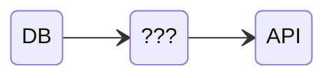
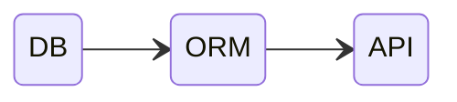
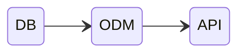

# Paradigmas de Bases de Datos

✏️ 2025-01 ➖ ⏱️ 25 min.

::header::
Semana 8: Paradigmas de Bases de Datos

::footer::
{{ $page }} / {{ $nav.total }}

---
layout: default-y-center
---

# Key-Value

::contents::
1. Redis
2. Memcache

::header::
Semana 8: Paradigmas de Bases de Datos

::footer::
{{ $page }} / {{ $nav.total }}

---
layout: default-y-center
---

# Key-Value

::contents::
| Key | Value |
| ----------- | ------------------- |
| user:23:bio | Unica e indiferente |
| user:24:bio | Artista. Poeta.     |
| user:25:bio | > Tauro > 19 > ⚕ |

::header::
Semana 8: Paradigmas de Bases de Datos

::footer::
{{ $page }} / {{ $nav.total }}

---
layout: default-y-center
---

# "Wide Column"

::contents::
1. Cassandra
2. HBase

::header::
Semana 8: Paradigmas de Bases de Datos

::footer::
{{ $page }} / {{ $nav.total }}

---
layout: default-y-center
---

# "Wide Column"

::contents::
| Key | Value |
| ----------- | ------------------- |
| user:23 | bio="Unica e indiferente"; nombre="Lena"  |
| user:24 | bio="Artista. Poeta."; nombre="Kidman"     |
| user:25 | bio="> Tauro > 19 > ⚕"; nombre="Maria" |

::header::
Semana 8: Paradigmas de Bases de Datos

::footer::
{{ $page }} / {{ $nav.total }}

---
layout: default-y-center
---

# Relational

::contents::
1. PostgreSQL
2. mySQL
3. SQLite

::header::
Semana 8: Paradigmas de Bases de Datos

::footer::
{{ $page }} / {{ $nav.total }}

---
layout: default-y-center
---

# Relational

::contents::
| id  | bio                 | name    | age |
| --- | ------------------- | ------- | --- |
| 23  | Unica e indiferente | Lena  | 26  |
| 24  | Artista. Poeta.     | Kidman | 16  |
| 25  | > Tauro > 19 > ⚕ | Maria | 17  |

::header::
Semana 8: Paradigmas de Bases de Datos

::footer::
{{ $page }} / {{ $nav.total }}

---
layout: default-y-center
---

# Graph

::contents::
1. Neo4j
2. d-graph

::header::
Semana 8: Paradigmas de Bases de Datos

::footer::
{{ $page }} / {{ $nav.total }}

---
layout: default-y-center
---

<style>
  img {
    width: 60%;
    margin: 0 auto;
  }
</style>

# Graph

::contents::


::header::
Semana 8: Paradigmas de Bases de Datos

::footer::
{{ $page }} / {{ $nav.total }}

---
layout: default-y-center
---

# Otros Paradigmas

::contents::
- Search (ej: Elastic, Solr, meili search)
- Multi-model (ej Fauna)

::header::
Semana 8: Paradigmas de Bases de Datos

::footer::
{{ $page }} / {{ $nav.total }}

---
layout: default-y-center
---

# Document

::contents::
1. **MongoDB**
2. Firebase

::header::
Semana 8: Paradigmas de Bases de Datos

::footer::
{{ $page }} / {{ $nav.total }}

---
layout: default-y-center
---

# Document

::contents::
```json {*}{lines:true}
{
  "id": 23,
  "bio": "Unica e indiferente",
  "age": 26,
}
```

::header::
Semana 8: Paradigmas de Bases de Datos

::footer::
{{ $page }} / {{ $nav.total }}

---
layout: default-y-center
---

# Base de datos

::contents::
- Contenida en un cluster
- Contiene collections

::header::
Semana 8: Paradigmas de Bases de Datos

::footer::
{{ $page }} / {{ $nav.total }}

---
layout: default-y-center
---

# Collections

::contents::
- Equivalente a una tabla en una BD relacional
- Contenida en un database
- Contiene documents

::header::
Semana 8: Paradigmas de Bases de Datos

::footer::
{{ $page }} / {{ $nav.total }}

---
layout: default-y-center
---

# Documents

::contents::
- Equivalente a una fila en una BD relacional
- Es contenido en una collection

::header::
Semana 8: Paradigmas de Bases de Datos

::footer::
{{ $page }} / {{ $nav.total }}

---
layout: default-y-center
---

<style scoped>
td, th {
  width: 200px;
  font-size: 1.5rem;
}
</style>

# DBs → Objetos

::contents::


::header::
Semana 8: Paradigmas de Bases de Datos

::footer::
{{ $page }} / {{ $nav.total }}

---
layout: default-y-center
---

<style scoped>
td, th {
  width: 200px;
  font-size: 1.5rem;
}
</style>

# Object Relational Mapping (ORM)

::contents::

- Interfaz entre una API y una base de datos (relational)
- "Transforma" una "fila" en objeto

::header::
Semana 8: Paradigmas de Bases de Datos

::footer::
{{ $page }} / {{ $nav.total }}

---
layout: default-y-center
---

# Object Relational Mapping (ORM)

::contents::
- Prisma
- Sequelize
- TypeORM
- Bookshelf.js
- Objection.js
- Waterline
- Knex.js

::header::
Semana 8: Paradigmas de Bases de Datos

::footer::
{{ $page }} / {{ $nav.total }}

---
layout: default-y-center
---

<style scoped>
td, th {
  width: 200px;
  font-size: 1.5rem;
}
</style>

# Object Document Mapping (ODM)

::contents::

- Interfaz entre una API y una base de datos (document)
- "Transforma" un documento en objeto

::header::
Semana 8: Paradigmas de Bases de Datos

::footer::
{{ $page }} / {{ $nav.total }}

---
layout: default-y-center
---

# Object Document Mapping (ODM)

::contents::
- Prisma
- **Mongoose**

::header::
Semana 8: Paradigmas de Bases de Datos

::footer::
{{ $page }} / {{ $nav.total }}

---
layout: cover
---

# 🎉

# Saben los paradigmas!