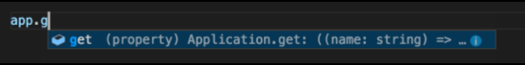
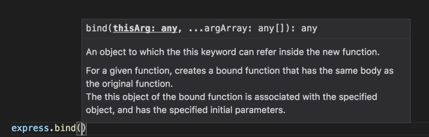
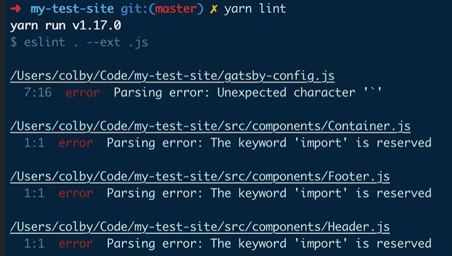
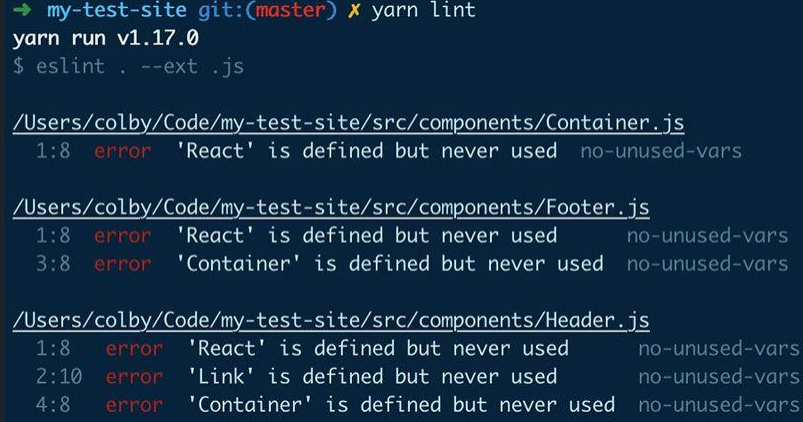
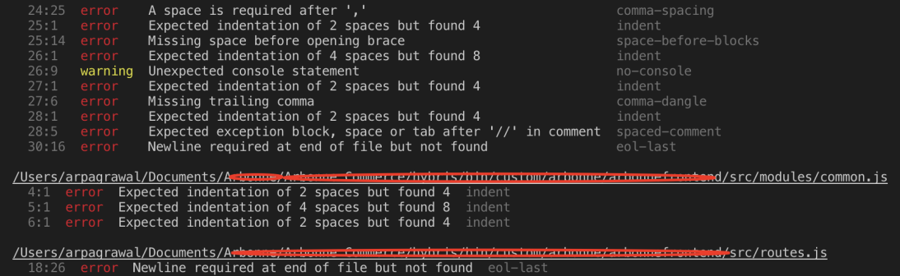
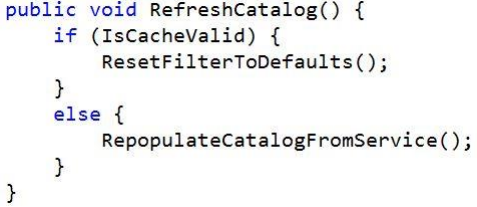
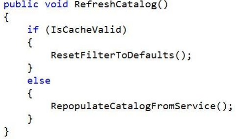
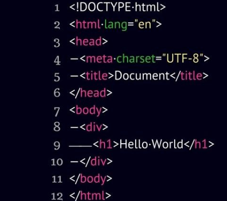
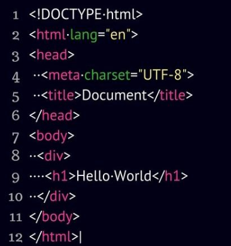

# Lint

Y Prettier e Intellisense

---

## Intellisense

---

<!--
_class: body-center align-center
 -->

## Intellisense

Intellisense es el nombre dado al sistema de autocompletado de
Visual Studio (y Visual Studio Code)

##

---

<!--
_class: body-center align-center
 -->

## Intellisense

En VSCode, el Intellisense de JS y TS viene incluido.

##

---

<!--
_class: body-center align-center
 -->

## Intellisense

Intellisense es lo que permite el autocompletado de cosas como
nombres de metodos.

##

---

<!--
_class: body-center align-center
 -->

## Intellisense

Informacion de parametros.

##

---

<!--
_class: body-center align-center
 -->

## Intellisense

Los packages usualmente tienen sus “tipos” para ayudar a Intellisense.

A veces los tipos vienen por separado.

##

---

<!--
_class: body-center align-center
 -->

## Lint

Lint era una programa para detectar pequeños errores en C.

##

---

<!--
_class: body-center align-center
 -->

## Lint

Hoy en dia, muchas funcionalidades de Lint las trae el mismo
compilador, o el IDE.

Muchas veces esto se dice que el IDE tiene un Linter.

##

---

## Lint

Que te ayuda a detectar un Linter?

- Errores de sintaxis
- Uso de variables no declaradas
- Llamado a funciones deprecadas
- Convenciones de espaciado y formato
- Uso incorrecto de alcance
- Sobreflujo en switch
- Uso de utilidades peligrosas del lenguaje

##

---

## Lint

Que te ayuda a detectar un Linter?

- Errores de sintaxis
- Uso de variables no declaradas
- Llamado a funciones deprecadas
- Convenciones de espaciado y formato
- Uso incorrecto de alcance
- Sobreflujo en switch
- Uso de utilidades peligrosas del lenguaje

##

---

## Lint

Que te ayuda a detectar un Linter?

- Errores de sintaxis
- Uso de variables no declaradas
- Llamado a funciones deprecadas
- Convenciones de espaciado y formato
- Uso incorrecto de alcance
- Sobreflujo en switch
- Uso de utilidades peligrosas del lenguaje

##

---

## Lint

Que te ayuda a detectar un Linter?

- Errores de sintaxis
- Uso de variables no declaradas
- Llamado a funciones deprecadas
- Convenciones de espaciado y formato
- Uso incorrecto de alcance
- Sobreflujo en switch
- Uso de utilidades peligrosas del lenguaje

---

## Lint

Que te ayuda a detectar un Linter?

- Errores de sintaxis
- Uso de variables no declaradas
- Llamado a funciones deprecadas
- Convenciones de espaciado y formato
- Uso incorrecto de alcance
- Sobreflujo en switch
- Uso de utilidades peligrosas del lenguaje

---

## Lint

Que te ayuda a detectar un Linter?

- Errores de sintaxis
- Uso de variables no declaradas
- Llamado a funciones deprecadas
- Convenciones de espaciado y formato
- Uso incorrecto de alcance
- Sobreflujo en switch
- Uso de utilidades peligrosas del lenguaje

---

## Lint

Que te ayuda a detectar un Linter?

- Errores de sintaxis
- Uso de variables no declaradas
- Llamado a funciones deprecadas
- Convenciones de espaciado y formato
- Uso incorrecto de alcance
- Sobreflujo en switch
- Uso de utilidades peligrosas del lenguaje

---

<!--
_class: body-center align-center
 -->

## Lint

---

<!--
_class: body-center align-center
 -->

## Lint

---

<!--
_class: body-center align-center
 -->

## Lint

---

## Lint

En Javascript,
usamos el package **eslint** para las funcionalidades de lint adicionales que queremos.

##

---

## Lint

Eslint nos permite tener el archivo de configuracion, y tambien el "auto fix"

##

---

<!--
_class: body-center align-center
 -->

## Lint

Lint es solo tan poderoso como se lo permitan.

##

---

<!--
_class: body-center align-center
 -->

## Prettier

Cada programador es distinto.

##

---

## Prettier

| Estan los desarrolladores que ponen las llaves  en la misma linea del if, | Y los desarrolladores que estan equivocados. |
| ----------------------------------------------------------------------------- | -------------------------------------------- |
|                                       |      |

---

## Prettier

| Estan los desarrolladores que usan tabulacion, | Y los desarrolladores que estan equivocados. |
| ---------------------------------------------- | -------------------------------------------- |
|        |      |

---

<!--
_class: body-center align-center
 -->

## Prettier

_Ley de la Trivialidad_

##

---

<!--
_class: body-center align-center
 -->

## Prettier

_Ley de la Trivialidad_

"people within an organization commonly or typically give
disproportionate weight to trivial issues."

##

---

<!--
_class: body-center align-center
 -->

## Prettier

_Ley de la Trivialidad_

"en una organizacion, tipicamente, se le da peso desproporcionado a trivialidades"

##

---

## Prettier

- Ponemos los punto y coma, o no?
- Tabs o espacios?
- Comas despues del ultimo element en un array, o no?
- CamelCase o snake_case?
- Comillas simples, o dobles?
- Ponemos espacio entre los items de un array, o no?

##

---

<!--
_class: body-center align-center
 -->

## Prettier

Prettier tambien se configura con su archivo de configuracion, y su
respective package.

##
