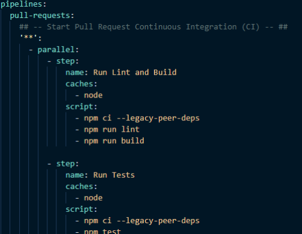
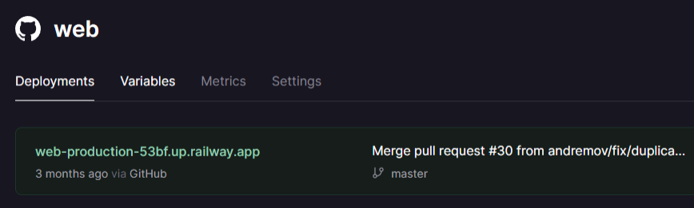

# Pipelines

CI + CD

---

## Que son CI + CD pipelines?

CI + CD pipelines son, esencialmente, codigo que automatize tareas
como estas:

##

---

## Que son CI+CD pipelines?

CI+CD pipelines son, esencialmente, codigo que automatize tareas
como estas:

1. Compilación

##

---

## Que son CI+CD pipelines?

CI+CD pipelines son, esencialmente, codigo que automatize tareas
como estas:

1. Compilación
2. Ejecución de Pruebas

##

---

## Que son CI+CD pipelines?

CI+CD pipelines son, esencialmente, codigo que automatize tareas
como estas:

1. Compilación
2. Ejecución de Pruebas
3. Despliegue de Aplicación

##

---

## Que son CI+CD pipelines?

CI+CD pipelines son, esencialmente, codigo que automatize tareas
como estas:

1. Compilación
2. Ejecución de Pruebas
3. Despliegue de Aplicación
4. Proceso de envio de software

##

---

<!--
_class: body-center align-center
 -->

## Que es CI?

CI es continuous integration.

##

---

<!--
class: body-center
 -->

## Que es Continuous Integration?

El concepto en que varios desarrolladores trabajan por separado y luego juntan (integran) el codigo en un solo repositorio

##

---

## Que es Continuous Integration?

Lo que hace el CI Pipeline es, automagicamente, compilar el codigo y ejecutar las pruebas, para asegurar que el codigo enviado no daña nada.

##

---

<!--
_class: body-center align-center
 -->

## Que es CD?

CI es continuous delivery.
O continuous deployment.
O ambos.

##

---

<!--
_class: body-center align-center
 -->

## Que es Continuous Deployment?

El proceso en que el codigo enviado es desplegado
automaticamente para revision.

##

---

## Que es Continuous Deployment?

O, para las ramas principales, el codigo es desplegado
automaticamente para los usuarios.

##

---

## Eso que significa?

Al enviar un Merge Request, El CI+CD pipeline se ejecuta. Esto
hace:

1. Una compilacion del proyecto completo con el codigo nuevo.
2. Una ejecucion de las pruebas existentes en el codigo.
3. Un despliegue en un ambiente de pruebas del codigo nuevo.

Si alguno de estos pasos falla, la pipeline falla, y el desarrollador puede revisar el error antes de llamar a un “supervisor” a revisar el codigo.

---

## En teoría,

Un desarrollador puede hacer estos tres pasos localmente como proceso de debug previo a enviar el codigo.

Pero a veces uno cree que todo está bien y no es necesario, entonces no lo hace.

Y a veces, el entorno remoto es distinto al local, causando errores
distintos, que deben ser resueltos al local.

**remote > local**

---

<!--
class: body-center align-center
 -->

## En teoría,

A fin de cuentas, el pipeline completo demora max 10 minutos en
correr, así que envia el codigo y ve por café. ☕

##

---

## Configuracion de un pipeline

Usualmente los pipelines (y su archivo de configuracion) dependen
de la Plataforma (github, gitlab, bitbucket) etc.

##

---

## Bitbucket

##

---

## Configuracion de un pipeline

Y, usualmente, las plataformas de hosting (planetscale, fly.io, railway), tienen para “integrarse” con el repo y tiene su propio CD pipeline por su lado.

##

---

## Github + Railway

##

---

## Git Hooks

Git Hooks son, mas o menos, un CI pipeline local.

##

---

## Git Hooks

Los hooks te permiten ejecutar codigo antes de, durante, o despues
de hacer un commit (por ejemplo, por que hay mas opciones).

##

---

## Git Hooks

Podrías, por ejemplo, tener un pre-commit hook que revise los
estilos y si no pasa, no te deja hacer commit.

##

---

## Git Hooks

Un buen package para manejar git hooks de manera mas chevere es

**husky**

`npm install husky`
