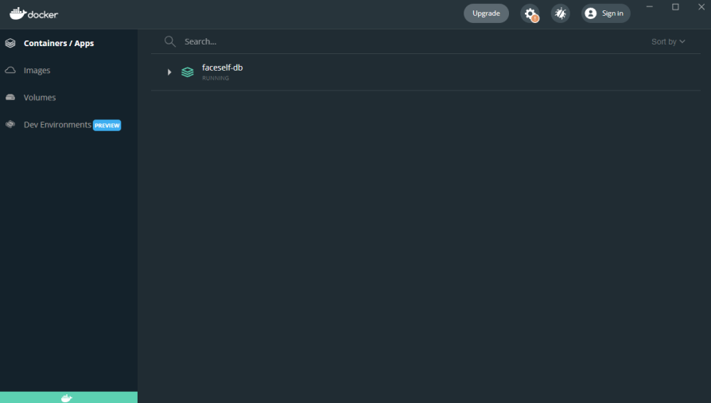
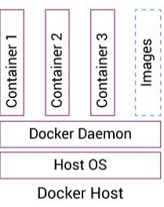

# Docker

:pencil: 2024-03 :heavy_minus_sign: :stopwatch: 10 min.

---

## Que es?

- Un programa cliente, que maneja containers
- Un comando
- Un programa servidor, que maneja un sistema de Linux
- Un programa que construye containers
- Un servicio que distribuye containers
- Una empresa que crea containers

##

---

<!--
_class: body-center align-center
 -->

 

## "Un programa cliente, que maneja containers"

---

## Que es un container?

"Un software empaquetado y autonomo, con Linux, y todo lo que
este requiere para correr el software o servicio."

##

---

## Como seria un backend container?

---

## Como seria un backend container?

- Node

##

---

Como seria un backend container?

- Node + NPM

##
---

## Como seria un backend container?

- Node + NPM
- Los packages requeridos

##
---

## Como seria un backend container?

- Node + NPM
- Los packages requeridos
- Mi codigo fuente

##
---

## Como seria un backend container?

- Linux
- Node + NPM
- Los packages requeridos
- Mi codigo fuente

##

---

## Como seria un backend container?

- Linux
- Node + NPM
- Los packages requeridos
- Mi codigo fuente

  ***

- Linux
- Mongo

---

## Que es?

- ~~Un programa cliente, que maneja containers~~
- Un comando
- Un programa servidor, que maneja un sistema de Linux
- Un programa que construye containers
- Un servicio que distribuye containers
- Una empresa que crea containers

##

---

## Un comando

Por ejemplo, `docker run hello-world`

Este comando intenta correr el container "hello-world"
No lo encuentra local, entonces lo descarga, y lo corre.

##

---

## Que es?

- ~~Un programa cliente, que maneja containers~~
- ~~Un comando~~
- Un programa servidor, que maneja un sistema de Linux
- Un programa que construye containers
- Un servicio que distribuye containers
- Una empresa que crea containers

##

---

<!--
  _class: body-center align-center
 -->

## "Un programa servidor, que maneja un sistema de Linux"

Docker tiene un servidor basado en Linux (VM) que maneja cada
container (tambien basado en Linux).

---

## Docker server + Docker cmd + Docker Desktop

El programa servidor de docker maneja todos los containers

Se pueden hacer cambios al programa servidor o los containers
usando el comando `docker`

Alternativamente, se puede utilizar la interfaz grafica "Docker Desktop"

##

---

## Que es?

- ~~Un programa cliente, que maneja containers~~
- ~~Un comando~~
- ~~Un programa servidor, que maneja un sistema de Linux~~
- Un programa que construye containers
- Un servicio que distribuye containers
- Una empresa que crea containers

##

---

<!--
  _class: body-center align-center
 -->

## "Un programa que construye containers"

Como se construye un container?

##

---

<!--
  _class: body-center
 -->

## Como se construye un container?

Un docker container se construye con un docker image.

`docker run hello-world`

Este comando intenta correr un docker container basado en la docker image "hello-world"

##

---

## Como se construye un container?

| Image                                        | Container                                              |
| -------------------------------------------- | ------------------------------------------------------ |
| Instrucciones para crear un docker container | Runtime environment de un docker image                 |
| Puede ser distribuido.                       | Se refiere a un ambiente especifico de un docker image |
| Puede ser "montado" varias veces.            |                                                        |
|                                              |                                                        |
| `docker run` ->                              | <- `docker commit`                                     |

##

---

## Que es?

- ~~Un programa cliente, que maneja containers~~
- ~~Un comando~~
- ~~Un programa servidor, que maneja un sistema de Linux~~
- ~~Un programa que construye containers~~
- Un servicio que distribuye containers
- Una empresa que crea containers

##

---

## Un servicio que distribuye containers

`docker run hello-world`

Intenta correr el container "hello-world".

1. No lo encuentra localmente.
2. **Entonces lo descarga**.
3. Lo corre.

##

---

<!--
_class: body-center align-center
-->

## Un servicio que distribuye containers

https://hub.docker.com/

##

---

## Que es?

- ~~Un programa cliente, que maneja containers~~
- ~~Un comando~~
- ~~Un programa servidor, que maneja un sistema de Linux~~
- ~~Un programa que construye containers~~
- ~~Un servicio que distribuye containers~~
- Una empresa que crea containers

##

---

<!--
_class: body-center align-center
-->

## Una empresa que crea containers

https://hub.docker.com/

##

---

## Que es?

- ~~Un programa cliente, que maneja containers~~
- ~~Un comando~~
- ~~Un programa servidor, que maneja un sistema de Linux~~
- ~~Un programa que construye containers~~
- ~~Un servicio que distribuye containers~~
- ~~Una empresa que crea containers~~

##

---

## Comandos utiles

- `docker ps`
  - Lista containers activos
- `docker exec <container> <command>`
  - Ejecuta un comando adicional en un container
- `docker attach <container>`
  - Adhiere el terminal al terminal del container
- `docker logs <container>`
  - Se explica solo
- `docker kill <container>`
  - Elimina un container

---

<!--
_class: align-center body-center
 -->

Docker Desktop y Comandos

`docker ps`

##

---

<!--
_class: title
 -->

# :tada:

# Son expertos en Docker!
