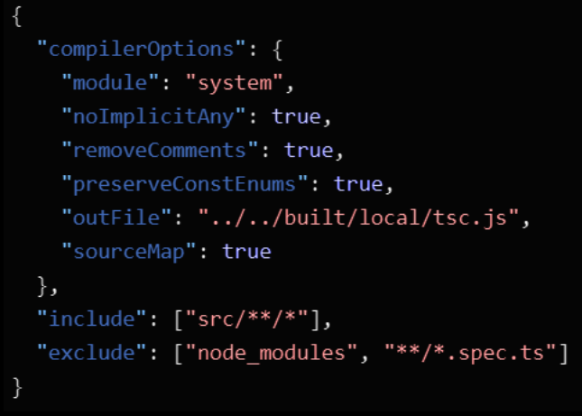

# Typescript

---

## Tipado

Javascript es un lenguaje de programacion con tipado debil.

##

---

## Tipado

"Tipado" hace referencia al posible requisito de un lenguaje de
programacion de declarar el tipo de una variable.

- Java tiene un tipado fuerte.
- JavaScript tiene un tipado debil.

##

---

## Tipado

"Tipado" hace referencia al posible requisito de un lenguaje de
programacion de declarar el tipo de una variable.

- Java tiene un tipado fuerte.
- JavaScript tiene un tipado debil.
- **TypeScript tiene un tipado fuerte.**

##

---

## Ejemplo

```js
function getUserAge(user, today) {
  return today - user.birthdate;
}
```

##

---

## Ejemplo

```js
function getUserAge(user, today) {
  return today - user.birthdate;
}

// que es user? que es today? que es user.birthdate? que somos? que?
```

##

---

<!--
_class: align-center body-center
 -->

## Typescript

Typescript es un lenguaje de programacion que transpila a Javascript.

##

---

## Pasos de adopción a Typescript

```js
// paso 1: un archivo JS con TS check
// @ts-check
function getUserAge(user, today) {
  return today – usor.birthdate; //es user, no usor
}
```

##

---

## Pasos de adopción a Typescript

```js
// paso 2: un archivo JS con JSDoc
// @ts-check
//*_ @param {any} user
function getUserAge(user, today) {
  return today - user.birthdate; // que es birthdate?
}
```

##

---

## Pasos de adopción a Typescript

```js
// paso 3: un archivo TS
function getUserAge(user: User, today: Date): number {
  return today - user.birthdate;
}
```

##

---

## Pasos de adopción a Typescript

```js
// paso 3: un archivo TS
function getUserAge(user: User, today: Date): number {
  return today - user.birthdate;
}
```

##

---

<!--
_class: align-center body-center
 -->

## Typescript

Pero lo mejor es en seguida usar archivos Typescript.
(es decir el paso 3)

##

---

<!--
_class: align-center body-center
 -->

## Instalación

`npm install typescript`

##

---

<!--
_class: align-center body-center
 -->

## Configuracion de TypeScript

tsconfig.json

##

---

<!--
_class: align-center body-center
 -->

## Configuracion de TypeScript



---

<!--
_class: align-center body-center
 -->

## Configuracion de TypeScript

https://www.typescriptlang.org/tsconfig

##

---

## Declaracion de una variable

```js
let variable1 = 1;
const variable2 = "2";
```

```js
let variable1: number = 1;
const variable2: string = "2";
```

##

---

## Y los arrays?

```js
let variable1 = [1, 3, 5];
```

```js
// ?
```

##

---

## Y los arrays?

```js
let variable1 = [1, 3, 5];
```

```js
let variable1: number[] = [1, 3, 5];
```

##

---

## Y los objetos?

```js
let usuario = {
  name: "Juancho",
  birthdate: "2002-10-05",
  semester: 7,
};
```

```js
// ?
```

##

---

## Y los objetos?

```js
let usuario = {
  name: "Juancho",
  birthdate: "2002-10-05",
  semester: 7,
};
```

```js
let usuario: {
  name: string,
  birthdate: Date,
  semester: number,
} = {
  name: "Juancho",
  birthdate: "2002-10-05",
  semester: 7,
};
```

##

---

## Y los objetos?

```js
let usuario1: {
  name: string,
  birthdate: Date,
  semester: number,
} = {
  name: "Juancho",
  birthdate: "2002-10-05",
  semester: 7,
};

let usuario2: {
  name: string,
  birthdate: Date,
  semester: number,
} = {
  name: "Juancha",
  birthdate: "2002-11-06",
  semester: 5,
};
```

---

## Tipos

```js
type User = {
  name: string,
  birthdate: Date,
  semester: number,
};

let usuario1: User = {
  name: "Juancho",
  birthdate: "2002-10-05",
  semester: 7,
};

let usuario2: User = {
  name: "Juancha",
  birthdate: "2002-11-06",
  semester: 5,
};
```

---

## Inferencia de tipos

```js
// de que tipo es esta variable? (segun typescript)
let variable1: number;
```

##

---

## Inferencia de tipos

```js
// de que tipo es esta variable? (segun typescript)
let variable1: number;

// segun TS, la variable es un numero,
// porque ahi lo dice
```

##

---

## Inferencia de tipos

```js
// de que tipo es esta variable? (segun typescript)
let variable1 = 1;
```

##

---

## Inferencia de tipos

```js
// de que tipo es esta variable? (segun typescript)
let variable1 = 1;

// segun TS, la variable es numero,
// porque el valor dado a la variable es un numero
```

##

---

## Inferencia de tipos

```js
// de que tipo es esta variable? (segun typescript)
let variable1;
```

##

---

## Inferencia de tipos

```js
// de que tipo es esta variable? (segun typescript)
let variable1;
// segun TS, es tipo "any"
```

##

---

## «Any»

El tipo "any" significa cualquier cosa.
Se recomienda evitar utilizarlo.
Se recomienda no permitir que se infiera.

##

---

## Declaracion de una funcion

```js
function suma(a, b) {
  return a + b;
}
```

```js
// cual es el tipo de a? b? a+b?
function suma(a, b) {
  return a + b;
}
```

---

## Declaracion de una funcion

```js
function suma(a: number, b: number) {
  return a + b;
}
```

##

---

## Declaracion de una funcion

```js
// y cual es el tipo de a+b?
function suma(a: number, b: number) {
  return a + b;
}
```

##

---

## Declaracion de una funcion

```js
// y cual es el tipo de a+b?
function suma(a: number, b: number) {
  return a + b;
}

// TS infiere que suma retorna un numero
```

##

---

## Declaracion de una funcion

```js
function suma(a: number, b: number): number {
  return a + b;
}
```

##

---

## Declaracion de una funcion (arrow)

```js
const suma = (a: number, b: number): number => {
  return a + b;
};
```

##

---

<!--
_class: title
 -->

## Pero bueno volvamos a los tipos

---

## Tipos

```js
type User = {
  name: string,
  birthdate: Date,
  semester: number,
};
```

##

---

## Fecha de Nacimiento quizá no es una "Fecha"

```js
type User = {
  name: string,
  birthdate: Date,
  semester: number,
};
```

Como permitimos que birthdate sea Date y string?

---

## Fecha de Nacimiento quizá no es una "Fecha"

```js
type User = {
  name: string,
  birthdate: Date | string,
  semester: number,
};
```

El simbolo | nos permite decir que una variable o campo puede tener dos o mas tipos.

---

## Agreguemos telefono

```js
type User = {
  name: string,
  birthdate: Date | string,
  semester: number,
};
```

Pero no todos tienen un telefono.

Como permitimos que User tenga telefono declarado, pero no todos los Users tienen telefono?

---

## Agreguemos telefono

```js
type User = {
  name: string,
  birthdate: Date | string,
  semester: number,
  telephone?: number,
};
```

El simbolo ? nos permite decir que un campo es opcional.

---

## Queremos administradores

```js
type User = {
  name: string,
  birthdate: Date | string,
  semester: number,
  telephone?: number,
};
```

Un administrador es como un usuario, pero tiene unos campos adicionales.

---

## Queremos administradores

```js
type User = {
  name: string,
  birthdate: Date | string,
  semester: number,
  telephone?: number,
};
```

```js
type Admin = {
  name: string,
  birthdate: Date | string,
  semester: number,
  telephone?: number,
  employeeID: number,
  department: string,
};
```

Pero no queremos repetirnos…

---

## Queremos administradores

```js
type User = {
  name: string,
  birthdate: Date | string,
  semester: number,
  telephone?: number,
  employeeID?: number,
  department?: string,
};
```

Podemos agregar los campos de Admin a User, y volverlos opcionales.

---

## Queremos administradores

```js
type User = {
  name: string,
  birthdate: Date | string,
  semester: number,
  telephone?: number,
};
type Admin = User & {
  employeeID: number,
  department: string,
};
```

##

---

## Type o Interface?

Son virtualmente lo mismo.

---

## Type o Interface?

```js
interface Animal {
  name: string;
}
interface Bear extends Animal {
  honey: boolean;
}
```

```js
type Animal = {
  name: string,
};
type Bear = Animal & {
  honey: boolean,
};
```

---

## Type o Interface?

```js
interface Window {
  title: string;
}
interface Window {
  ts: TypeScriptAPI;
}
```

✅ Todo bien

```js
type Window = {
  title: string,
};
type Window = {
  ts: TypeScriptAPI,
};
```

⚠ Window ya existe

---

## "Yo se lo que es"

```js
function func1(value: number): string | number {
  if (value < 5) {
    return "Error.";
  } else {
    return value;
  }
}
```

##

---

## "Yo se lo que es"

```js
function func1(value: number): string | number {
  if (value < 5) {
    return "Error.";
  } else {
    return value;
  }
}
console.log(func1(6) * 10); // multiplicando una string?
```

##

---

## "Yo se lo que es"

```js
function func1(value: number): string | number {
  if (value < 5) {
    return "Error.";
  } else {
    return value;
  }
}

console.log(<number>func1(6) * 10)
console.log(func1(6) as number * 10)
```

##

---

## Tipos literales

```js
function compara(a: number, b: number) {
  if (a === b) {
    return 0;
  } else if (a < b) {
    return -1;
  }
  return 1;
}
```

##

---

## Tipos literales

```js
function compara(a: number, b: number): -1 | 0 | 1 {
  if (a === b) {
    return 0;
  } else if (a < b) {
    return -1;
  }
  return 1;
}
```

##

---

## Tipos literales

```js
function compara(a: number, b: number): -1 | 0 | 1 {
  if (a === b) {
    return 0;
  } else if (a < b) {
    return -1;
  }
  return 1;
}
```

Tambien se puede con strings.
Y con Booleans pero eso es como tonto.

---

## Generics

```js
function sum<X>(a: X, b: X): X {
  return a + b;
}
```

##

---

## Generics

```ts
// como permito que la funcion sum concatene
// dos strings si es el caso?
function sum(a: number, b: number): number {
  return a + b;
}

console.log(sum(2, 3));
console.log(sum("a", "b")); // Error
```

##

---

## Generics

```ts
// usando generics, podemos decir que ambos params
// son un tipo, que tambien es el del resultado
function sum<X>(a: X, b: X): X {
  return a + b;
}

console.log(sum<number>(2, 3));
console.log(sum<string>("a", "b"));
```

##

---

## Utility Types

- Partial<Type>
  - Todos los campos de Type, pero todos opcionales
- Required<Type>
  - Todos los campos de Type, pero todos obligatorios
- Pick<Type, Keys> // Pick<User, “name" | “semester">
  - Solo los campos Keys de Type
- Omit<Type, Keys>
  - Todos los campos de Type, excepto Keys

##
