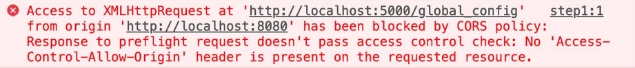
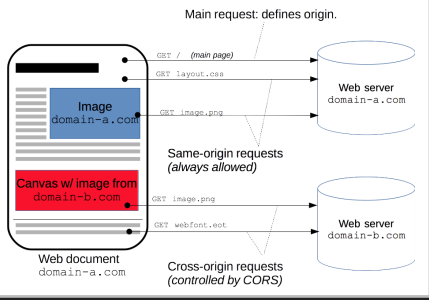

# Node & NPM

:pencil: 2024-03 :heavy_minus_sign: :stopwatch: 30 min.

---

<!--
 _class: align-center body-center
  -->

## Que es NodeJS?

Un _runtime environment_ para JS.

##

---

<!--
 _class: align-center body-center
  -->

## Que es un _Runtime Environment_ ?

Coloquialmente, es donde corre un programa.

##

---

<!--
 _class: align-center body-center
  -->

## Que es NPM?

**N**ode **P**ackage **M**anager

##

---

<!--
 _class: align-center body-center
  -->

## Que es un package?

Un “pequeño” software instalable/agregable a una aplicación de Node que agrega/modifica funcionalidad.

##

---

<!--
 _class: align-center body-center
  -->

## Que es un package?

Todos los packages están listados en https://www.npmjs.com/

##

---

<!--
 _class: body-center
  -->

## Creando un proyecto de Node

```
$ npm init
```

##

---

<!--
 _class: body-center
  -->

## Creando un proyecto de Node - Rapido

```
$ npm init --y
```

##

---

<!--
 _class: body-center
  -->

## Creando un proyecto de Node

```js
{
"name": "test",
"version": "1.0.0",
"description": "",
"main": "index.js",
"scripts": {
  "test": "node index"
},
"author": "",
"license": "ISC",
}
```

##

---

<!--
_class: title
 -->

## Express

---

## Un server sencillo

```js
const http = require("http");

function requestListener(req, res) {
  res.writeHead(200);
  res.end("Hello, World!");
}

const server = http.createServer(requestListener);
server.listen(8080);
```

##

---

## Nodemon

Un package que nos permite hacer "hot reloading", es decir, que al realizar cambios el servidor automaticamente se reinicie.

##

---

<!--
_class: body-center
-->

## Nodemon?

Node ya implementó una manera de hacer esto sin instalar packages externos:

```
$ node --watch index.js
```

Sin embargo, Nodemon tiene otras funcionalidades.

##

---

<!--
_class: body-center align-center
-->

## Instalar un package

npm i \<nombre>

##

---

<!--
_class: body-center align-center
-->

## Instalar nodemon

npm i nodemon

npm install nodemon

##

---

## Responder con JSON

```js
const requestListener = function (req, res) {
  res.setHeader("Content-Type", "application/json");
  res.writeHead(200);
  res.end(`{"message": "This is a JSON response"}`);
};
```

##

---

<!--
_class: body-center align-center
-->

## JSON

**J**ava **S**cript **O**bject **N**otation

O, Notación de Objeto de JavaScript.

Es una manera de representar (en una string) un objeto de JavaScript.
Tipicamente se espera enviar y recibir datos usando JSON.

##

---

<!--
_class: body-center align-center
-->

## Express

npm i express

##

---

## Inicialización de un servidor de Express

```js
const express = require("express");
const app = express();
```

##

---

## Un Endpoint en Express

```js
app.get("/", async function (req, res) {
  res.status(200).json({ message: "Success" });
});
```

##

---

## Escuchar por peticiones en Express

```js
const port = 3000;
app.listen(port, () => {
  console.log(`Example app listening on port ${port}`);
});
```

##

---

<!--
_class: body-center align-center
-->
<style scoped>
  h2:nth-child(3) {
    font-size: 6rem;
    text-align: center;
  }
</style>

## Operaciones basicas de almacenamiento

## CRUD

##

---

<!--
_class: body-center
-->

## Operaciones basicas de almacenamiento

1. ## C
2. ## R
3. ## U
4. ## D

---

<!--
_class: body-center
-->

## Operaciones basicas de almacenamiento

1. ## C
2. ## R
3. ## U
4. ## creaDo

---

<!--
_class: body-center
-->

## Operaciones basicas de almacenamiento

1. ## C
2. ## R
3. ## hUsmear
4. ## creaDo

---

<!--
_class: body-center
-->

## Operaciones basicas de almacenamiento

1. ## aCtualizar
2. ## R
3. ## hUsmear
4. ## creaDo

---

<!--
_class: body-center
-->

## Operaciones basicas de almacenamiento

1. ## aCtualizar
2. ## borRar
3. ## hUsmear
4. ## creaDo

---

<!--
_class: body-center
-->

## Operaciones basicas de almacenamiento

1. ## Create
2. ## Read
3. ## Update
4. ## Delete

---

<!--
_class: body-center
 -->

 <style scoped>
  table {
    text-align: center;
  }
 </style>

## Metodos HTTP

|         |        |         |
| ------- | ------ | ------- |
| GET     | HEAD   | POST    |
| PUT     | DELETE | CONNECT |
| OPTIONS | TRACE  | PATCH   |

##

---

<!--
_class: body-center
 -->

 <style scoped>
  table {
    text-align: center;
  }
 </style>

## Metodos HTTP

| GET | PUT | POST | PATCH | DELETE |
| --- | --- | ---- | ----- | ------ |

| OPTIONS | TRACE | HEAD | CONNECT |
| ------- | ----- | ---- | ------- |

##

---

<!--
_class: body-center
 -->

 <style scoped>
  table {
    text-align: center;
  }
 </style>

## Metodos HTTP => CRUD

| GET  | PUT           | POST   | PATCH  | DELETE |
| ---- | ------------- | ------ | ------ | ------ |
|      |               |        |        |        |
| READ | UPDATE/CREATE | CREATE | UPDATE | DELETE |

##

---

<!--
_class: body-center align-center
 -->

## Put vs Patch

Put sobre-escribe (o crea) un recurso.

Patch modifica un recurso ya existente.

##

---

<!--
_class: body-center align-center
 -->

## Metodos HTTP => CRUD

| GET  | PUT           | POST   | PATCH  | DELETE |
| ---- | ------------- | ------ | ------ | ------ |
|      |               |        |        |        |
| READ | UPDATE/CREATE | CREATE | UPDATE | DELETE |

##

---

<!--
_class: body-center align-center
 -->

## CORS

**Cross-Origin Resource Sharing**

1. Medida de seguridad para prevenir abuso.
2. Previene utilizar recursos de otro origen a menos que este lo permita.

##

---

<!--
_class: body-center align-center
 -->

## CORS



##

---

<!--
_class: body-center align-center
 -->

## CORS



##

---

<!--
_class: body-center align-center
 -->

## Metodo OPTIONS + CORS

El metodo OPTIONS tiene como proposito preguntar los permisos de CORS al origen del recurso previo a solicitar el recurso.

##

---

<!--
_class: body-center align-center
 -->

## CORS

Un problema de CORS 99% de las veces es un problema de backend.

##

---

<!--
_class: body-center align-center
 -->

## CORS

Un navegador hace un metodo OPTIONS para saber los permisos.

Un cliente REST NO.

Clientes REST como Postman, ThunderClient, Insomnia, etc.

##

---

<!--
_class: body-center
 -->

## CORS

Front end dev: "Este endpoint me tira error."
Back end dev: "Pero lo pruebo en Postman y me funciona sin problema."

Conclusión: Revisa CORS.

##

---

<!--
_class: body-center
 -->

## CORS - Solución

```js
app.use(function (req, res, next) {
  res.header("Access-Control-Allow-Origin", "*");
  res.header("Access-Control-Allow-Headers", "*");
  if (req.method === "OPTIONS") {
    res.header("Access-Control-Allow-Methods", "PUT, POST, PATCH, DELETE, GET");
    return res.status(200).json({});
  }
  next();
});
```

Agregar este endpoint al inicio del server responde toda petición de OPTIONS con accesso permitido para todo.

##

---

<!--
_class: body-center
 -->

## CORS - Solución

```js
$ npm i cors
```

Este package hace todo lo que hace el endpoint anterior.

##

---

<!--
_class: body-center
 -->

## CORS - Solución 2

```js
let express = require("express");
let cors = require("cors");
let app = express();

app.use(cors());

app.get("/products/:id", function (req, res, next) {
  res.json({ msg: "This is CORS-enabled for all origins!" });
});
```

##

---

<!--
_class: body-center
 -->

## "Fallbacks"

```js
app.use(async function (req, res) {
  res.status(404).json({ message: "Not found." });
});
```

Este endpoint va al final, para recibir toda petición que no fue servida por otros endpoints.

##
