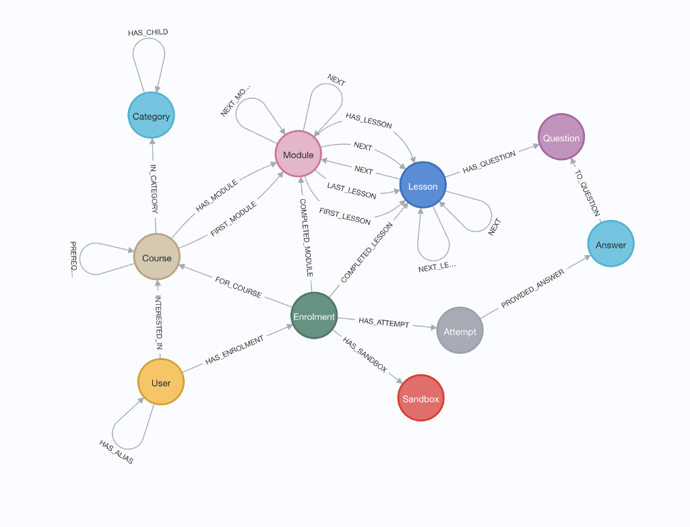

# Paradigmas de Bases de Datos

:pencil: 2024-03 :heavy_minus_sign: :stopwatch: 25 min.

---

## Key-Value

1. Redis
2. Memcache

##

---

## Key-Value

| user:23:bio | Unica e indiferente |
| ----------- | ------------------- |
| user:24:bio | Artista. Poeta.     |
| user:25:bio | > Escorpio > 19 > ⚕ |

##

---

## "Wide Column"

1. Cassandra
2. HBase

##

---

## "Wide Column"

| user:23 | bio="Unica e indiferente"; nombre="Angela"  |
| ------- | ------------------------------------------- |
| user:24 | bio="Artista. Poeta."; nombre="Ernesto"     |
| user:25 | bio="> Escorpio > 19 > ⚕"; nombre="Daniela" |

##

---

## Relational

1. PostgreSQL
2. mySQL
3. SQLite

##

---

## Relational

| id  | bio                 | name    | age |
| --- | ------------------- | ------- | --- |
| 23  | Unica e indiferente | Angela  | 26  |
| 24  | Artista. Poeta.     | Ernesto | 16  |
| 25  | > Escorpio > 19 > ⚕ | Daniela | 17  |

##

---

## Graph

1. Neo4j
2. d-graph

##

---

<!--
_class: align-center body-center
 -->

<style scoped>
  img {
    height: 500px;
  }
</style>>

## Graph



##

---

## Otros

- Search (ej: Elastic, Solr, meili search)
- Multi-model (ej Fauna)

##

---

## Document

1. MongoDB
2. Firebase

##

---

## Document

```js
{
  "id": 23,
  "bio": "Unica e indiferente",
  "age": 26,
}
```

##

---

## Base de datos

- Contenida en un cluster
- Contiene collections

##

---

## Collections

- Equivalente a una tabla en una BD relacional
- Contenida en un database
- Contiene documents

##

---

## Documents

- Equivalente a una fila en una BD relacional
- Es contenido en una collection

##

---

<style scoped>
td, th {
  width: 200px;
  font-size: 1.5rem;
}
</style>

## DBs → Objetos

| DB  | ?   | API |
| --- | --- | --- |

##

---

<style scoped>
td, th {
  width: 200px;
  font-size: 1.5rem;
}
</style>

## Object Relational Mapping (ORM)

- Interfaz entre una API y una base de datos (relational)
- "Transforma" una "fila" en objeto

| DB  | ORM | API |
| --- | --- | --- |

##

---

## Object Relational Mapping (ORM)

- Prisma
- Sequelize
- TypeORM
- Bookshelf.js
- Objection.js
- Waterline
- Knex.js

##

---

<style scoped>
td, th {
  width: 200px;
  font-size: 1.5rem;
}
</style>

## Object Document Mapping (ODM)

- Interfaz entre una API y una base de datos (document)
- "Transforma" un documento en objeto

| Document DB | ODM | API |
| ----------- | --- | --- |

##

---

## Object Document Mapping (ODM)

- Prisma
- **Mongoose**

##
