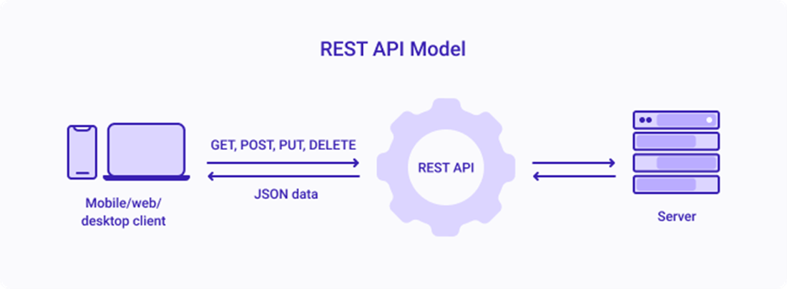

# Introduccion al desarrollo back-end

---

<!--
_class: title
 -->

## Que es "back-end"?

---

<!--
_class: title
 -->

Back-end es aquello que **no** es front-end.

---

<!--
_class: title
 -->

## Que es "front-end"?

---

<!--
_class: align-center
 -->

## Front-end

Se considera "front-end" aquello que manipula el usuario, o el lado de la aplicacion que esta bajo el control del usuario.

##

---

<!--
_class: align-center
 -->

## Back-end

Se considera "back-end" aquello que **NO** manipula el usuario, o el lado de la aplicacion que **NO** esta bajo el control del usuario.

##

---

<!--
_class: align-center
 -->

## Back-end

Para las aplicaciones web,

El front-end es la pagina web.
El back-end es _el resto_.

##

---

<!--
_class: align-center
 -->

## Back-end

Para cualquier aplicacion,

El front-end es la interfaz de usuario (y el programa que lo contiene).
El back-end es _todo lo otro_.

##

---

<!--
_class: align-center
 -->

## Back-end

El front-end tambien es llamado "el cliente", o "client-side".

El back-end tambien es llamado "el servidor", o "server-side".

##

---

<!--
_class: align-center
 -->

## Back-end

En terminos del modelo MVC:

Vista: Frontend

Modelo: Backend

Controlador: ?

##

---

<!--
_class: align-center
 -->

## Back-end

En terminos del modelo MVC:

Vista: Frontend

Modelo: Backend

Controlador: ?

##

---

<!--
_class: align-center
 -->

## Back-end

En terminos del modelo MVC:

Vista: Frontend

Modelo: Backend

Controlador: ?

##

---

<!--
_class: align-center
 -->

## Back-end

En terminos del modelo MVC:

Vista: Frontend

Modelo: Backend

Controlador: ?

##

---

<!--
_class: align-center
 -->

## Back-end

En terminos del modelo MVC:

Vista: Frontend

Modelo: Backend

Controlador: ?

##

---

<!--
_class: title
 -->

---

<!--
_class: title
 -->

Front-end / Vista

Controlador

Back-end / Modelo

---

<!--
_class: title
 -->

Front-end / Vista

Back-end / Controlador + Modelo

---

<!--
_class: align-center
 -->

## Que es una aplicacion web?

Una aplicacion a la que se accede usando un navegador.

Adicionalmente, puede ser una aplicacion desarrollada usando tecnologias tipicamente usadas en desarrollo web.

##

---

<!--
_class: body-center
 -->

## Historia del Desarrollo Web I

1969: Las universidades UCLA y Stanford se conectan usando cable de telefono (ARPANET).

1983: Se cambia el protocolo NCP por TCP/IP.

1986: Se desarrolla el "arbol del internet", conectando varias "redes" a lo largo del mundo para tener una sola gran red.

##

---

<!--
_class: body-center
 -->

## Historia del Desarrollo Web II

1990: Se comienza a programar la "web".

1991: Primer "navegador" web (solo texto)

1993: Primer navegador web con texto y graficos en linea.

##

---

<!--
_class: body-center
 -->

## Historia del Desarrollo Web III

1993: Primera programacion web por lado de servidor.

1995: Nace PHP

1995: Nace Apache

1995: Nace MySQL

Luego entonces, nace LAMP stack.

##

---

<!--
_class: body-center
 -->

## Que es una stack?

Una stack, o tech stack, es el conjunto de tecnologias primarias utilizadas en una aplicacion, sea web o no.

El termino viene de la idea de que las tecnologias estan "stacked", una encima de la otra. Como una hamburguesa.

##

---

<!--
_class: body-center
 -->

## Que es LAMP stack?

Un servidor con Linux de OS.

Corriendo Apache como software servidor.

Guardando datos con MySQL.

Recibiendo y respondiendo peticiones con PHP/Perl/Python.

##

---

<!--
_class: body-center
 -->

## Que es LAMP stack?

Un servidor con Linux de OS.

Corriendo Apache como software servidor.

Guardando datos con MySQL.

Recibiendo y respondiendo peticiones con PHP/Perl/Python.

##

---

<!--
_class: body-center
 -->

## Que es LAMP stack?

Un servidor con Linux de OS.

Corriendo Apache como software servidor.

Guardando datos con MySQL.

Recibiendo y respondiendo peticiones con PHP/Perl/Python.

##

---

<!--
_class: body-center
 -->

## Que es LAMP stack?

Un servidor con Linux de OS.

Corriendo Apache como software servidor.

Guardando datos con MySQL.

Recibiendo y respondiendo peticiones con PHP/Perl/Python.

##

---

<!--
_class: body-center
 -->

## Que es LAMP stack?

**L**inux de OS.

**A**pache como software servidor.

**M**ySQL de base de datos.

**P**HP, **P**erl o **P**ython en el servidor.

##

---

<!--
_class: title
 -->

1995: Nace JavaScript.

---

<!--
_class: title
_paginate: false
_header: ''
 -->

1995: Nace JavaScript.
