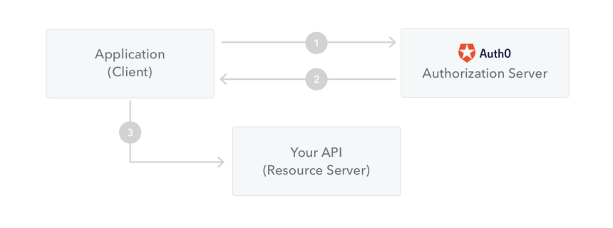
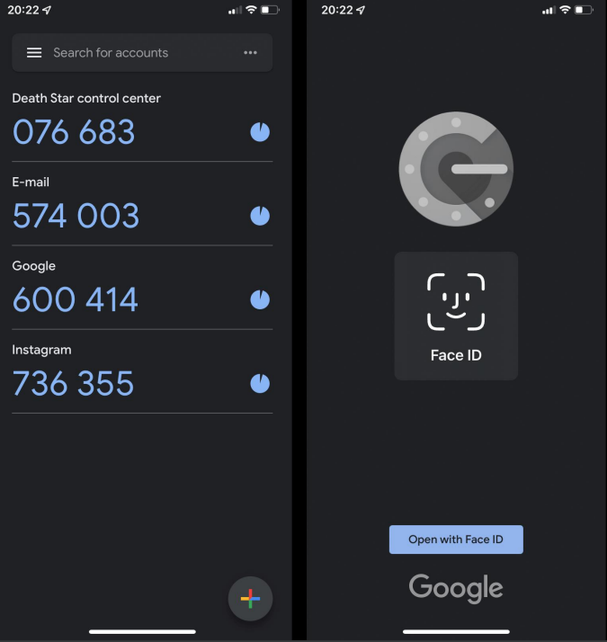

# Autenticacion

y JWT

---

<!--
_class: body-center align-center
 -->

## Que es?

Es el proceso de probar un hecho, o que un documento es genuino.

##

---

<!--
_class: body-center align-center
 -->

## En nuestro caso,

Tipicamente, se refiere a “probar que eres un usuario en
especifico”.

##

---

## Proceso

1. Usuario provee credenciales.
2. Los credenciales son verificados.
3. Usuario es autenticado,

##

---

## Ejemplos

• Usuario y contraseña
• Correo y contraseña
• Cedula y contraseña
• Cedula y Fecha de expedicion

##

---

<!--
_class: body-center align-center
 -->

## Proceso, de nuevo



##

---

<!--
_class: title
 -->

## Auth0

---

## Auth0

Auth0 es un servidor de autorizacion externo, un servicio de
autorizacion.

##

---

## Auth0?

Nosotros no usaremos Auth0.

##

---

## Auth0 vs. …

Cual es la diferencia entre Auth0 y…
• Login con Google?
• Login con Facebook?
• Login con Github?
• Login con Apple?

##

---

<!--
_class: body-center align-center
 -->

## Auth0 vs. Otros proveedores de Auth

Para el usuario, ninguna.
Para ti, control.

##

---

<!--
_class: body-center align-center
 -->

<style scoped>
  p:nth-child(5){
    color: rgba(var(--text-color),0.6)
  }
</style>

## Token de Autorizacion

##

Los servicios de autenticacion devuelven un token de autorizacion.
Tipicamente, en web dev, estos son **JWT**.

JSON Web Tokens

##

---

<!--
_class: body-center align-center
 -->

## JWT

Esencialmente, es una string, con los datos referentes a un usuario o sesion cifrados en el.

```js
eyJhbGciOiJIUzI1NiIsInR5cCI6IkpXVCJ9
  .eyJzdWIiOiIxMjM0NTY3ODkwIiwibmFtZSI6IkpvaG4gRG9lIiwiaWF0IjoxNTE2MjM5MDIyfQ
  .SflKxwRJSMeKKF2QT4fwpMeJf36POk6yJV_adQssw5c;
```

##

---

<style scoped>
  li {
    color: rgba(var(--text-color), 0.6)
  }
  .white {
    color: rgba(var(--text-color), 1)
  }
</style>

## Partes de un JWT

1. <span class="white">Encabezado</span>
   - <span class="white">Usualmente solo describe que es un JWT con cierto algoritmo.</span>
2. Cuerpo
3. Firma

```js
eyJhbGciOiJIUzI1NiIsInR5cCI6IkpXVCJ9 // 1
  .eyJzdWIiOiIxMjM0NTY3ODkwIiwibmFtZSI6IkpvaG4gRG9lIiwiaWF0IjoxNTE2MjM5MDIyfQ // 2
  .SflKxwRJSMeKKF2QT4fwpMeJf36POk6yJV_adQssw5c; // 3
```

##

---

<style scoped>
  li {
    color: rgba(var(--text-color), 0.6)
  }
  .white {
    color: rgba(var(--text-color), 1)
  }
</style>

## Partes de un JWT

1. Encabezado
2. <span class="white">Cuerpo</span>
   - <span class="white">Contiene los datos que uno quiere tener.</span>
3. Firma

```js
eyJhbGciOiJIUzI1NiIsInR5cCI6IkpXVCJ9 // 1
  .eyJzdWIiOiIxMjM0NTY3ODkwIiwibmFtZSI6IkpvaG4gRG9lIiwiaWF0IjoxNTE2MjM5MDIyfQ // 2
  .SflKxwRJSMeKKF2QT4fwpMeJf36POk6yJV_adQssw5c; // 3
```

##

---

<style scoped>
  li {
    color: rgba(var(--text-color), 0.6)
  }
  .white {
    color: rgba(var(--text-color), 1)
  }
</style>

## Partes de un JWT

1. Encabezado
2. Cuerpo
3. <span class="white">Firma</span>
   - <span class="white">Algo como los “bits de validacion”</span>

```js
eyJhbGciOiJIUzI1NiIsInR5cCI6IkpXVCJ9 // 1
  .eyJzdWIiOiIxMjM0NTY3ODkwIiwibmFtZSI6IkpvaG4gRG9lIiwiaWF0IjoxNTE2MjM5MDIyfQ // 2
  .SflKxwRJSMeKKF2QT4fwpMeJf36POk6yJV_adQssw5c; // 3
```

##

---

## Cuerpo de un JWT

1. Existen propiedades registradas
   1. iss → Identificador de quien creo el JWT
   2. exp → Fecha de expiracion del JWT
   3. sub → Identificador del sujeto siendo autenticado
   4. aud → Identifica la audiencia del JWT (para quien es?)
   5. etc → Et Cetera, expresion en latin que significa “y el resto”
2. Las propiedades deberian ser de solo 3 caracteres, para que el JWT sea compacto.
3. Todos son opcionales, tu verás que tienes en tu JWT

##

---

## Cuerpo de un JWT

1. Que pasa si creo un JWT vacio?
2. Que pasa si creo un JWT con iss, aud, pero no exp?
3. Que pasa si mi campo iss de mi JWT no hace referencia a la entidad que realizó la autenticacion?

##

---

## Cuerpo de un JWT

```js
{
  "sub": "1234567890",
  "name": "John Doe",
  "admin": true
}
```

##

---

## JWT con NodeJS

```js
npm install jsonwebtoken
```

##

---

## JWT con NodeJS

```js
const jwt = require('jsonwebtoken’);

jwt.sign(payload, secretOrPrivateKey, [options, callback])
```

##

---

<!--
_class: body-center align-center
 -->

## Listo, tengo mi JWT

Y ahora que?

##

---

<!--
_class: body-center align-center
 -->

## Autorizacion

Al recibir el JWT, el cliente debería acompañar toda request siguiente con el header de Authorization.

##

---

<!--
_class: body-center align-center
 -->

## Autorizacion

Authorization: Bearer [token]

##

---

<style scoped>
  p:nth-child(4) {
    color: rgba(var(--text-color), 0.6);
  }
</style>

<!--
_class: body-center align-center
 -->

## Ojo

Como los JWT se envian por encabezado para autorizacion, se debe tomar en cuenta que a veces hay un limite de 8 KB.

8 KB es bastante, pero yo aviso.

##

---

<!--
_class: body-center align-center
 -->

## Autorizacion

Finalmente, recae en nosotros recibir el header de Authorization, validar la informacion, y permitir o denegar acceso según sea el caso.

##

---

<!--
_class: title
 -->

# Intermision

---

<!--
_class: title
 -->

<style scoped>
  p {
    color: rgba(var(--text-color), 0.6);
  }
</style>

# MFA

Multi Factor Authentication

##

---

## Authentication

1. Usuario + contraseña → 1FA

##

---

## Authentication

1. Usuario + contraseña → 1FA
2. Pin → 1FA

##

---

## Authentication

1. Usuario + contraseña → 1FA
2. Pin → 1FA
3. Llamada o texto al cel → 1FA

##

---

## Authentication

1. Usuario + contraseña → 1FA
2. Pin → 1FA
3. Llamada o texto al cel → 1FA
4. Huella → 1FA

##

---

## Authentication

1. Usuario + contraseña → 1FA
2. Pin → 1FA
3. Llamada o texto al cel → 1FA
4. Huella → 1FA
5. (Usuario + contraseña) + (Pin) → 2FA

##

---

<style scoped>
  img {
    position: absolute;
    top: 0;
    right: 0;
  }
</style>

## Pin?



---

## 2FA con NodeJS

```js
$ npm install node-2fa
```

##

---

## Creacion de un secret

```js
const twofactor = require("node-2fa");
const newSecret = twofactor.generateSecret({
  [name], [account]
});
```

##

---

<!--
_class: body-center align-center
-->

## Secret?

El secret es lo que utiliza una app de Auth para generar los tokens.

##

---

## Generate Secret

```js
// Ejemplo de respuesta de generar secret
{
  secret: 'XDQXYCP5AC6FA32FQXDGJSPBIDYNKK5W',
  uri: 'otpauth://totp/My%20Awesome%20App:johndoe?secret=XDQXYCP5AC6FA32FQXDGJSPBIDYNKK5W&issuer=My%20Awesome%20App',
  qr: 'https://chart.googleapis.com/chart?chs=166x166&chld=L|0&cht=qr&chl=otpauth://totp/My%20Awesome%20App:johndoe%3Fsecret=XDQXYCP5AC6FA32FQXDGJSPBIDYNKK5W%26issuer=My%20Awesome%20App'
}
```

##

---

## Generate Secret

```js
// Peticion
twofactor.generateSecret({[name], [account]});
// Respuesta
{
  secret: [secret],
  uri: 'otpauth://totp/[name]:[account]?secret=[secret]&issuer=[name]',
  qr: 'https://chart.googleapis.com/chart?chs=166x166&chld=L|0&cht=qr&chl=[uri]'
}
```

Ojo con los datos [name], [account], [secret] y [uri].

##

---

## Creacion de un secret

```js
const twofactor = require("node-2fa");

const newSecret = twofactor.generateSecret({
  [name], [account]
});
```

##

---

## Generar un token

```js
const twofactor = require("node-2fa");

// esto es para pruebas
const newToken = twofactor.generateToken(<secret>);
// → { token: '630618' }
```

##

---

## Verificar un token

```js
const twofactor = require("node-2fa");

// window es 4, predeterminado
// 1 window → 1 minuto
twofactor.verifyToken(<secret>, <token>, <window>);
// → { delta: 0 }
```

##

---

## Verificar un token

```js
// → { delta: 0 }
// que pasa si delta es -1?
// que pasa si es +1?
// que pasa si es 0?
```

##
