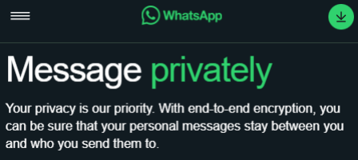

# Hqfulswdflrq

y sensitive data

---

<!--
_header: ""
_class: invert title
-->

# Encriptación

y sensitive data

---

<!--
_class: body-center align-center
-->

## Que es?

El proceso de codificar informacion por razones de seguridad.

##

---

## Porque nos interesa?

1. Privacidad
2. Seguridad
3. Integridad de Datos
4. Regulaciones

##

---

<!--
_class: body-center align-center
-->

## Porque nos interesa? - Privacidad

##

---

<!--
_class: body-center align-center
-->

## Porque nos interesa? - Privacidad

Mensajes, informacion personal, etc.

##

---

<!--
_class: body-center align-center
-->

## Porque nos interesa? - Seguridad

##

---

<!--
_class: body-center align-center
-->

## Porque nos interesa? - Seguridad

##

En los mensajes puede haber informacion sensible o de seguridad.

"Como es que es la contraseña?"

##

---

<!--
_class: body-center align-center
-->

## Porque nos interesa? - Seguridad

Y claro, de por si esa informacion sensible o de seguridad debería estar encriptada al ser almacenada.

##

---

<!--
_class: body-center align-center
-->

## Porque nos interesa? - Integridad de Datos

El encriptado de información asegura que los datos no fueron _vistos_
ni _modificados_ en el camino a su destino.

##

---

<!--
_class: body-center align-center
-->

## Porque nos interesa? - Regulaciones

Existen regulaciones gubernamentales y de la industria.

##

---

## Como funciona?

1. Informacion a encriptar
2. Proceso de encriptado
3. Informacion encriptada
4. Proceso de desencriptado
5. Informacion desencriptada

##

---

## Por ejemplo,

| Paso                                              | Encriptado? |
| ------------------------------------------------- | ----------- |
| Anita le escribe un mensaje a Juan.               |             |
| Whatsapp (de Anita) envía el mensaje al servidor. |             |
| El servidor envía el mensaje a Juan.              |             |
| Whatsapp (de Juan) recibe el mensaje.             |             |
| Juan lee el mensaje.                              |             |

##

---

## Por ejemplo,

| Paso                                              | Encriptado? |
| ------------------------------------------------- | ----------- |
| Anita le escribe un mensaje a Juan.               | No          |
| Whatsapp (de Anita) envía el mensaje al servidor. |             |
| El servidor envía el mensaje a Juan.              |             |
| Whatsapp (de Juan) recibe el mensaje.             |             |
| Juan lee el mensaje.                              |             |

##

---

## Por ejemplo,

| Paso                                              | Encriptado? |
| ------------------------------------------------- | ----------- |
| Anita le escribe un mensaje a Juan.               | No          |
| Whatsapp (de Anita) envía el mensaje al servidor. | Si          |
| El servidor envía el mensaje a Juan.              |             |
| Whatsapp (de Juan) recibe el mensaje.             |             |
| Juan lee el mensaje.                              |             |

##

---

## Por ejemplo,

| Paso                                              | Encriptado? |
| ------------------------------------------------- | ----------- |
| Anita le escribe un mensaje a Juan.               | No          |
| Whatsapp (de Anita) envía el mensaje al servidor. | Si          |
| El servidor envía el mensaje a Juan.              | Si          |
| Whatsapp (de Juan) recibe el mensaje.             |             |
| Juan lee el mensaje.                              |             |

##

---

## Por ejemplo,

| Paso                                              | Encriptado? |
| ------------------------------------------------- | ----------- |
| Anita le escribe un mensaje a Juan.               | No          |
| Whatsapp (de Anita) envía el mensaje al servidor. | Si          |
| El servidor envía el mensaje a Juan.              | Si          |
| Whatsapp (de Juan) recibe el mensaje.             | No          |
| Juan lee el mensaje.                              |             |

##

---

## Por ejemplo,

| Paso                                              | Encriptado? |
| ------------------------------------------------- | ----------- |
| Anita le escribe un mensaje a Juan.               | No          |
| Whatsapp (de Anita) envía el mensaje al servidor. | Si          |
| El servidor envía el mensaje a Juan.              | Si          |
| Whatsapp (de Juan) recibe el mensaje.             | No          |
| Juan lee el mensaje.                              | No          |

##

---

<!--
_class: body-center align-center
 -->

## Como funciona?

Se toma el texto original, llamado "texto plano" o "plaintext", se usa un algoritmo de cifrado con una llave y este retorna el texto cifrado, o "cyphertext".

El proceso de desencriptado es del mismo modo, en sentido contrario.

##

---

## Tipos de encriptación

Simetrica y Asimetrica

##

---

## Encriptacion Asimetrica

Se tiene una llave publica, y una privada.

La llave publica es “publica”.

La llave privada es privada.

###

---

## Encriptacion Asimetrica

La llave publica se utiliza para encriptar.

La llave privada se utiliza para desencriptar.

“No pasa nada” si la llave publica se “filtra”.

Igual no es el deber ser.

##

---

## Encriptacion Simetrica

En vez de tener una llave publica y otra privada, la encriptacion simetrica usa una misma llave privada que comparten ambos lados de la transferencia.

##

---

## Encriptacion Simetrica

Como ambas son la misma llave (literalmente), si se filtra cualquiera, es grave.

Ambas se usan tanto para encriptar como desencriptar.

##

---

## Encriptacion Simetrica

"Y como se ponen de acuerdo ambos lados para tener la misma llave?"

Se la mandan entre si.

##

---

## Encriptacion Simetrica

"Pero entonces la llave no es vulnerable cuando se transfiere?"

Si.

##

---

## Encriptacion Simetrica

"Y entonces?"

Entonces, la encriptacion simetrica requiere que la llave privada sea encriptada de alguna forma durante la transferencia.

Y asi se protegen las contraseñas?

Podrían.

Pero no.

##

---

<!--
_class: title
 -->

## Password Hashing

y sensitive data

---

## Hashing vs Encriptacion

- Ambos son metodos de proteccion de datos.
- La encriptacion es un proceso reversible.
- El hashing no es reversible.

##

---

## Encriptacion para contraseñas

Si se usa encriptacion para proteger contraseñas, estas son vulnerables.

##

---

## Encriptacion para contraseñas

Con la llave, se desencripta la contraseña.

##

---

## Hashing para contraseñas

Cual llave? No hay llave.

##

---

## Hashing para contraseñas

"No sé cual es la contraseña, pero esa no es."

##

---

## Como funciona la encriptacion?

Se toma el texto original, llamado “texto plano” o “plaintext”, se usa un algoritmo de cifrado con una llave y este retorna el texto cifrado, o "cyphertext".

El proceso de desencriptado es del mismo modo, en sentido contrario.

##

---

## Como funciona el hashing?

Se toma el texto original, llamado “texto plano” o “plaintext”, se usa un algoritmo de hashing y este retorna el hash.

No hay manera real de saber que texto original era el hash.

Pero para todo texto plano hay un y solo un hash.

##

---

## Como funciona el hashing?

"Pero para todo texto plano hay un y solo un hash."

Esto significa que aunque no sepas que texto era un hash, si te dicen un texto tu puedes verificar si ese texto es o no el hash.

##

---

## Proceso de hashing

Por esto, se considera el hashing una mejor medida de seguridad para las contraseñas y datos similares.

##

---

## Contraseñas iguales

Que pasa si dos usuarios tienen la misma contraseña?

##

---

## Salt

Salt es una string generada aleatoriamente que es agregada a un
texto previo al proceso de hash.

##

---

## Salt

La salt se puede almacenar junto al password sin ser encriptada ni
nada, asi en plaintext.

##

---

## Salt

Si decifran la contraseña de usuario1, y ven el resultado del hash en la DB, no encontrarán (en teoría) otro hash igual, indiferente de si es o no la misma contraseña.

##

---

## Salt

Tambien protege ante rainbow tables, que son tablas precomputadas de cualquier texto possible ante un proceso de hashing especifico.

##

---

## Pepper

Pepper es un amiguito de Salt.

Pepper funciona igual que Salt, pero no está almacenado en la base de datos, y es la misma para todos.

Podría estar, por ejemplo, en el codigo (si, quemado).

##

---

## Salt + Pepper

El uso de ambos significa que un atacante requeriría tanto acceso a la base de datos, como acceso al codigo fuente de la aplicación.

##

---

<!--
_class: body-center align-center
 -->

## Algoritmos de Hashing de Contraseñas

Según la Competencia de Hashing de Contraseñas, el mejor
algoritmo actualmente, y desde el 2017, es:

Argon2.

Previamente, era bcrypt.

##
