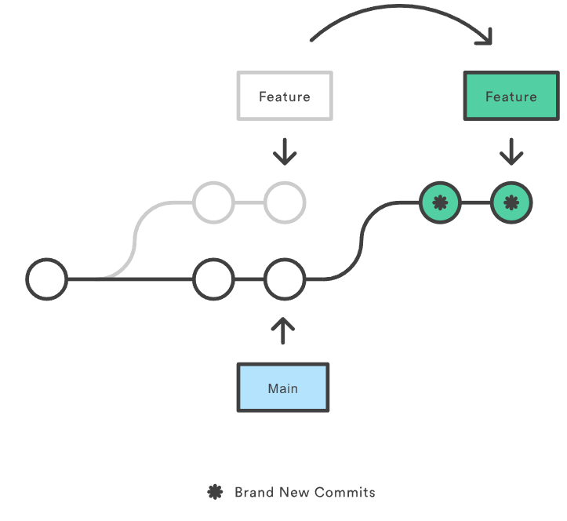

 <style>
    .star {
      color: rgba(220, 140, 60, 1);
    }
 </style>

# Git

---

<!--
_class: body-center align-center
 -->

## Que es Git?

Git es un sistema de control de versiones.

##

---

<!--
_class: body-center align-center
 -->

## GitHub, GitLab, BitBucket

Paginas web que proveen hosting de repositorios de Git.

##

---

<!--
_class: body-center align-center
 -->

## <span class="star">:star: Concepto 1:</span> Repositorio

Un repositorio (de software) o “repo”, es un almacenamiento para un software.

Usualmente, un repo equivale a un proyecto.

##

---

<!--
_class: body-center align-center
 -->

## <span class="star">:star: Concepto 2:</span> Commit

Un commit es una entrada en el historial de cambios de un repositorio.

"Un commit es un cambio."

##

---

<!--
_class: body-center align-center
 -->

## <span class="star">:star: Concepto 3:</span> .gitignore

Archivo con reglas para excluir archivos o carpetas de git.

Si un archivo o carpeta ya tiene historial en git, el .gitignore es ignorado.

##

---

<!--
_class: body-center
 -->

## <span class="star">:star: Concepto 3:</span> .gitignore

```js
.env
.env.local
.env.development
```

##

---

<!--
_class: body-center align-center
 -->

## <span class="star">:star: Concepto 4:</span> Stage y Unstage

Los cambios realizados en un software o proyecto deben ser agregados a lo que se llama “staging área”.

##

---

<!--
_class: body-center align-center
 -->

## <span class="star">:star: Concepto 4:</span> Stage y Unstage

Cree dos archivos: archivo1.js y archivo2.js

| Cambios       | Staging Area | Commit |
| ------------- | ------------ | ------ |
| + archivo1.js |              |        |
| + archivo2.js |              |        |

##

---

<!--
_class: body-center align-center
 -->

## <span class="star">:star: Concepto 4:</span> Stage y Unstage

Hice **stage** de la creacion de archivo1.js

| Cambios       | Staging Area  | Commit |
| ------------- | ------------- | ------ |
|               | + archivo1.js |        |
| + archivo2.js |               |        |

##

---

<!--
_class: body-center align-center
 -->

## <span class="star">:star: Concepto 4:</span> Stage y Unstage

Hago commit de los cambios en la staging area.

| Cambios       | Staging Area | Commit        |
| ------------- | ------------ | ------------- |
|               |              | + archivo1.js |
| + archivo2.js |              |               |

##

---

<!--
_class: body-center align-center
 -->

## <span class="star">:star: Concepto 4:</span> Stage y Unstage

Que pasa si hago un commit ahora mismo?

| Cambios       | Staging Area | Commit        |
| ------------- | ------------ | ------------- |
|               |              | + archivo1.js |
| + archivo2.js |              |               |

##

---

<style scoped>
td:nth-child(2) {
    background: rgba(30, 30, 100, 0.9);
}
</style>

<!--
_class: body-center align-center
 -->

## <span class="star">:star: Concepto 4:</span> Stage y Unstage

Nada, porque el staging area esta vacio.

| Cambios       | Staging Area | Commit        |
| ------------- | ------------ | ------------- |
|               |              | + archivo1.js |
| + archivo2.js |              |               |

##

---

<!--
_class: body-center align-center
 -->

## <span class="star">:star: Concepto 4:</span> Stage y Unstage

Los cambios realizados en un software o proyecto deben ser agregados a lo que se llama “staging área”.

Al hacer un commit, solo lo que esté en el staging área será parte del commit.

##

---

<!--
_class: body-center align-center
 -->

## <span class="star">:star: Concepto 4:</span> Stage y Unstage

Unstage es cuando un cambio en el staging area es removido del staging area.

| Cambios       | Staging Area  | Commit |
| ------------- | ------------- | ------ |
|               | + archivo1.js |        |
| + archivo2.js |               |        |

##

---

<!--
_class: body-center align-center
 -->

## <span class="star">:star: Concepto 4:</span> Stage y Unstage

Unstage es cuando un cambio en el staging area es removido del staging area.

| Cambios       | Staging Area | Commit |
| ------------- | ------------ | ------ |
| + archivo1.js |              |        |
| + archivo2.js |              |        |

##

---

<!--
_class: body-center align-center
 -->

## <span class="star">:star: Concepto 5:</span> Branches

Una "branch", o rama, es una línea de desarrollo independiente al desarrollo
principal.

Las ramas permiten el desarrollo simultaneo de varias tareas sin
dañar el producto presentado al cliente, ni el trabajo de los compañeros.

##

---

<!--
_class: body-center align-center
 -->

## <span class="star">:star: Concepto 5:</span> Branches

Las ramas parten de un commit "origen", y luego suelen juntarse a otra rama.

Que otra rama?

##

---

<!--
_class: body-center
 -->

### Setup normal en produccion y flujo de trabajo

Por lo general, se manejan las siguientes ramas:

1. main / production / prod
2. staging / testing / qa
3. development / develop / dev
4. features / fixes / refactors / chores / etc

##

---

<!--
_class: body-center
 -->

 <style scoped>
  p:nth-child(6) {
    font-size: 0.75rem;
    color: rgba(var(--text-color), 0.7);
  }
 </style>

## 1. main / production / prod

Esta rama es la que usa el cliente final.

Es la versión actual desplegada, funcional y estable.

A esta rama no se permiten commits directos\*.

\* A menos que sea 200% necesario, lo hace un Senior developer, y es lo que se le llama un **hotfix**.

---

<!--
_class: body-center
 -->

 <style scoped>
  p:nth-child(8) {
    font-size: 0.75rem;
    color: rgba(var(--text-color), 0.7);
  }
 </style>

## 2. staging / testing / qa

Esta rama se usa internamente para probar o demostrar la aplicación afuera del equipo de desarrollo.

Está desplegada en un link interno.

Es funcional y estable.

Al ser aprobada, todos los cambios de staging se mandan a main.

A esta rama no se permiten commits directos\*.

\* En casos muy extraños.

---

<!--
_class: body-center
 -->

 <style scoped>
  p:nth-child(8) {
    font-size: 0.75rem;
    color: rgba(var(--text-color), 0.7);
  }
 </style>

## 3. development / develop / dev

Esta rama se usa internamente para verificar que “hasta ahora todo está bien”, usualmente adentro del equipo de desarrollo.

Está desplegada en un link interno.

A veces funciona. Estabilidad es pedir mucho.

Al ser aprobada, todos los cambios de dev se mandan a staging.

A esta rama no se permiten commits directos\*.

\* Porque para que?

---

<!--
_class: body-center
 -->

## 4. features / fixes / refactors / chores / etc

No es una sola rama, son varias.

Cada una de estas ramas representa una tarea en proceso de un desarrollador.

Al ser aprobada, la rama se junta con dev.

##

---

<!--
_class: body-center align-center
 -->

## <span class="star">:star: Concepto 6:</span> Merge

Merge es la acción de juntar una rama con otra, y con ella, sus cambios.

##

---

<!--
_class: body-center
 -->

## Quien decide los merges?

1. De feature --> dev, el líder del equipo de desarrollo, o cualquier persona que
   sepa lo que hace.

2. De dev --> staging, el líder del equipo de desarrollo, o el product owner/project
   manager

3. De staging --> production, el product owner/project manager

##

---

<!--
_class: body-center
 -->

## Quien decide los merges?

1. De feature --> dev, el líder del equipo de desarrollo, o cualquier persona que sepa lo que hace.

2. De dev --> staging, el líder del equipo de desarrollo, o el product owner/project manager

3. De staging --> production, el product owner/project manager

##

---

<!--
_class: body-center align-center
 -->

## <span class="star">:star: Concepto 7:</span> Check Out

Accion de moverse entre 2 ramas.

_Estoy en rama 1, hago check out a rama 2._

##

---

<!--
_class: body-center
 -->

## Flujo de trabajo normal de un dev

1. Creas una rama
2. Trabajas la tarea asignada, separando el progreso en commits
3. Al terminar la tarea, creas un pull request o merge request (es lo mismo)
4. Si te piden cambios, los realizas.
5. Te aprueban la tarea, y tu branch se merge con la dev branch.

##

---

<!--
_class: body-center
 -->

## Flujo de trabajo normal de un dev

1. Creas la rama para la tarea #1
2. Trabajas la tarea
3. Al terminar la tarea, creas el PR
4. Mientras que te revisan la branch de la tarea, te devuelves al paso 1 pero con la tarea # i+1

##

---

<!--
_class: title
 -->

## Intermision

---

<!--
_class: body-center align-center
 -->

## <span class="star">:star: Concepto 9:</span> Stash

Guardar unos cambios en proceso para mas tarde.

##

---

<!--
_class: body-center
 -->

## Stash vs commit?

1. No se puede hacer checkout con cambios pendientes.
2. A veces un repositorio no permite commits con errores.
3. Quizá hiciste los cambios en la branch que no es.

##

---

<!--
_class: body-center
 -->

## <span class="star">:star: Concepto 9:</span> Stash

Puedes crear un stash con los cambios que tengas, y hacer **pop**, es decir tomar los cambios y destruir la stash, o **apply**, es decir tomar los cambios y dejar la stash ahi.

**Apply** permite aplicar unos mismos cambios de una stash a varias branches, por ejemplo.

##

---

<!--
_class: body-center align-center
 -->

## <span class="star">:star: Concepto 10:</span> Blame

Accion que muestra el autor de un cambio.

##

---

<!--
_class: body-center align-center
 -->

## <span class="star">:star: Concepto 11:</span> Cherry Pick

Accion de copiar un commit de un branch, o sus cambios, (con el proposito de aplicarlo de nuevo).

##

---

<!--
_class: body-center align-center
 -->

## <span class="star">:star: Concepto 12:</span> Rebase

Accion de cambiar el commit origen de una branch/rama.

##

---

<!--
_class: body-center align-center
 -->

 <style scoped>
  img {
    border-radius: 24px;
    height: 80%;
  }
 </style>

## <span class="star">:star: Concepto 12:</span> Rebase



##

---

<!--
_class: body-center align-center
 -->

## <span class="star">:star: Concepto 14:</span> Remote

"Remote" hace referencia a la "nube".

##

---

<!--
_class: body-center align-center
 -->

## <span class="star">:star: Concepto 14:</span> Remote

Remote es el repositorio (y branches) que están en la nube.

Los “merges” solo cuentan si se hacen en la nube.

Para esto, ambas branches deben estar en la nube.

##

---

<!--
_class: body-center align-center
 -->

## <span class="star">:star: Concepto 14:</span> Remote

Como pueden estar las branches en la nube?

##

---

<!--
_class: body-center align-center
 -->

## <span class="star">:star: Concepto 15:</span> Push + Pull

**Push**: Enviar cambios de una branch local a la versión remota de la branch.

**Pull**: Bajar los cambios de una branch remota a la versión local de la branch.

##

---

<!--
_class: body-center align-center
 -->

## <span class="star">:star: Concepto 15:</span> Push + Pull

Si la branch remota no existe, push la crearía en el repo remote.

Si la branch local no existe, pull la crearía en el repo local.

##

---

<!--
_class: body-center align-center
 -->

## <span class="star">:star: Concepto 16:</span> Reset

Un reset borra los commits de una branch desde el ultimo commit, hasta el commit seleccionado.

Los stashes no se ven afectados.

##

---

<!--
_class: body-center align-center
 -->

## <span class="star">:star: Concepto 16:</span> Reset: Hard Reset

En un hard reset, toda la informacion de los commits a borrar se pierde.

Cualquier cambio que se tenia en local, o en staging, se pierde.

##

---

<!--
_class: body-center align-center
 -->

## <span class="star">:star: Concepto 16:</span> Reset: Soft Reset

En un soft reset, toda la informacion de los commits a borrar se vuelven cambios actuales.

Cualquier cambio que se tiene en local, o en staging, se queda donde estaba.

##

---

<!--
_class: body-center align-center
 -->

## <span class="star">:star: Concepto 17:</span> Conflictos

Sucede cuando dos branches que se intentan merge tienen cambios en la misma ubicacion (aproximadamente).

Para terminar el merge, esos conflictos deben resolverse.

##

---

<!--
_class: body-center
 -->

## <span class="star">:star: Concepto 17:</span> Conflictos

En el codigo, los conflictos se ven asi

```js

<<<<<< HEAD
codigo1
=======
codigo2
>>>>>> new_branch_to_merge_later

```

##

---

<!--
_class: body-center align-center
 -->

## <span class="star">:star: Concepto 19:</span> Revisiones y Aprobaciones

En un ambiente profesional, las ramas no se merge asi como si nada.

Otro desarrollador lo debe revisar y lo aprobar.

Tras ser aprobado, se hace merge.

Usualmente no se niegan, solo se siguen trabajando.

##
